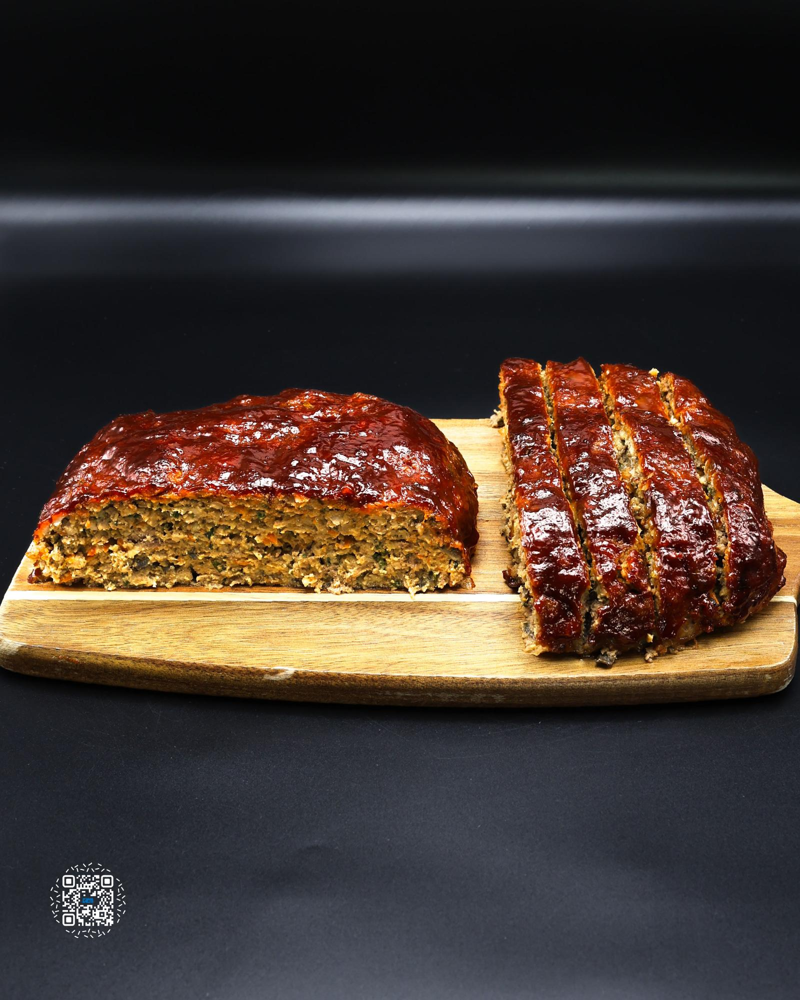

# MEATLOAF

**Serves:** 8 | **Prep:** 40 MINS | **Cook:** 35 MINS

## Macros

| Calories | Fat | Carbs | Net Carbs | Protein |
|----------|-----|-------|-----------|---------|
| 286 | 12 | 14 | N/A | 29 |

## Ingredients

### LOAF

- 56g breadcrumbs
- 120g fat-free milk
- 1 egg
- 15g soy sauce
- 14g gelatin
- 10g avocado oil
- 300g onion, grated
- 100g carrot, grated
- 15g garlic, minced
- 5g smoked paprika
- 112g cremini mushrooms, chopped
- 15g fresh parsley, chopped
- 448g 93% lean ground beef
- 448g 90% lean ground pork
- 10g salt
- 4g black pepper

### GLAZE

- 100g ketchup, no sugar added
- 30g Worcestershire sauce
- 15g sriracha
- 40g brown sugar erythritol

## Directions

1. Add breadcrumbs, milk, egg, soy sauce, and gelatin to a large bowl and whisk to combine.
2. Grate onion, carrot, and garlic. Add avocado oil to a preheated pot on medium heat along with the grated vegetables. Stir to combine.
3. Finely chop parsley and mushrooms and add to the bowl with the breadcrumb mixture.
4. Stir the pot full of vegetables and add a pinch of salt. Allow vegetables to sauté for another 1-2 minutes, add smoked paprika, and mix one more time. Let the vegetables sauté for an additional 30 seconds and add to the breadcrumb mixture.
5. Add beef, pork, salt, and pepper to the breadcrumb mixture. Mix all ingredients together until combined.
6. If you can't get pork, you can use all ground beef instead.
7. Add meat mixture to an aluminum foil lined sheet pan and form into a 10x6 inch rectangle.
8. Spray hands with oil for a much easier time shaping the loaf.
9. Place meatloaf under a broiler for 8-10 minutes or until a brown sear occurs across the top of the loaf. The meatloaf should be sitting about 4-6 inches from the broiler.
10. While the meatloaf is broiling, add ketchup, worch, sriracha, and erythritol to a bowl and mix to combine. The glaze is ready.
11. Brush a thick layer of glaze on the top and sides of the meatloaf. Place in a preheated 400°F oven for 15 minutes.
12. Add a second layer of glaze to the meatloaf and continue baking for another 5-10 minutes or until the internal temperature reaches 140-145°F throughout the loaf.
13. Apply any leftover glaze and allow the meatloaf to set for 15-20 minutes. Cut into ½" slices and enjoy this lower calorie version of an American Classic.

