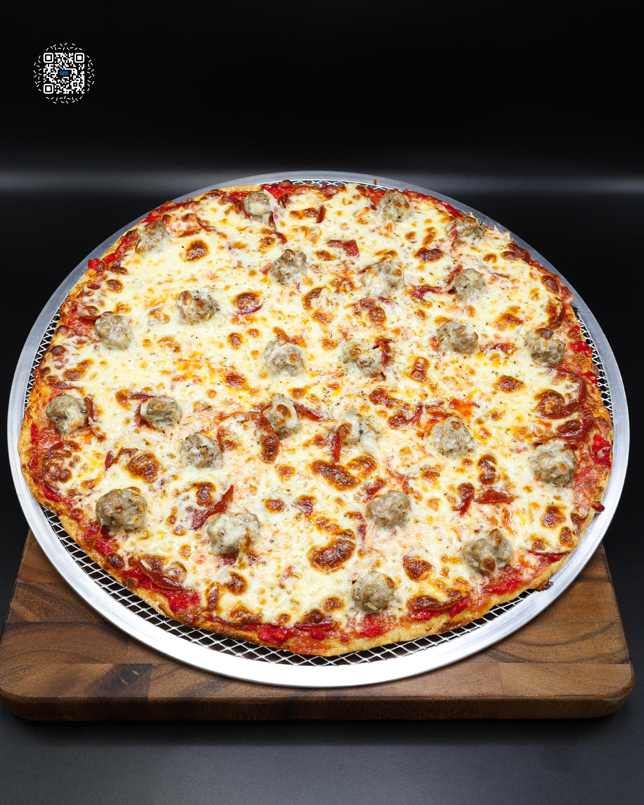

# SAUSAGE AND PEPPERONI PIZZA

**Serves:** 4 | **Prep:** 2 HRS | **Cook:** 10 MINS

## Macros

| Calories | Fat | Carbs | Net Carbs | Protein |
|----------|-----|-------|-----------|---------|
| 571 | 22 | 43 | N/A | 54 |

## Ingredients

### DOUGH (MAKES 2)

- 340g all-purpose flour
- 90g vital wheat gluten
- 3g yeast
- 8g salt
- 240g warm water
- 16g olive oil

### PIZZA SAUCE

- 780g 6 in 1 ground tomatoes
- 14g olive oil
- 9g garlic, minced
- 4.5g salt

### ITALIAN SAUSAGE

- 448g 90% lean ground pork
- 8g salt
- 8g garlic, minced
- 4g fennel seed
- 3g ground fennel
- 2g ground anise
- 2g garlic powder
- 1g black pepper
- 0.5g crushed red pepper
- 0.5g dried oregano

### PIZZA BUILD

- 6g corn meal
- 1 dough
- 176g pizza sauce
- 8g Pecorino Romano, grated
- 8g Parmigiano-Reggiano, grated
- 239g Italian sausage
- 84g turkey pepperoni
- 112g fat-free mozzarella cheese
- 182g part-skim mozzarella cheese
- Sprinkle dried oregano

## Directions

1. In a large bowl, combine flour, vital wheat gluten, yeast, and salt. Whisk to evenly distribute.
2. Add water and olive oil. Mix with a spoon until a shaggy dough forms.
3. Using a wet hand, press and fold the dough until fully combined and no dry flour remains. Cover and rest 20-30 minutes.
4. With a wet hand, pull one side of the dough up as high as possible and fold it over itself. Rotate the bowl 90° and repeat 3-4 times. Flip the dough, form into a ball, cover, and rest 20-30 minutes.
5. Repeat step 4.
6. Divide the dough into 2 pieces, about 345g each.
7. Flatten each piece, fold the edges into the center, flip seam-side down, and shape into a smooth ball by pulling it toward yourself. Rotate 90° and repeat until tight.
8. Place each dough ball in a container and refrigerate for 24 hours.
9. Combine all Italian sausage ingredients in a bowl. Mix thoroughly and refrigerate for 24 hours.
10. Combine all pizza sauce ingredients in a high-sided container. Mix to combine and refrigerate.
11. Remove one dough from the fridge 2-3 hours before shaping.
12. Lightly sprinkle cornmeal on top of the dough. Flip onto the counter and dust the bottom with additional cornmeal.
13. Flip the dough back over. Using your fingers, press the dough outward until it's 8-10 inches wide.
14. Using a rolling pin, roll back and forth twice. Rotate the dough 90° and repeat. Continue until the dough reaches 10-12 inches.
15. Lift the dough and stretch using your fists underneath, rotating in a circular motion until evenly stretched.
16. Stretch the outer crust by holding it with your fingertips and rotating until the dough reaches 14-16 inches.
17. Transfer to a 16-inch sheet of parchment paper. Lightly roll the crust to remove air pockets and adjust thickness if needed.
18. Place the pizza sauce in the center of the dough and spread evenly, leaving a quarter inch border for the crust.
19. Add remaining toppings in the order listed in the ingredients section.
20. Bake in a preheated 500°F oven for 8-12 minutes or until the cheese is browned to your preference.
21. Transfer pizza to a wire rack for 2-3 minutes. Return to the pizza steel for an additional 2-3 minutes with the oven door slightly cracked.
22. Enjoy an authentic Chicago pizza.

## Tips

Any crushed tomatoes you prefer can be used instead of 6-in-1.

