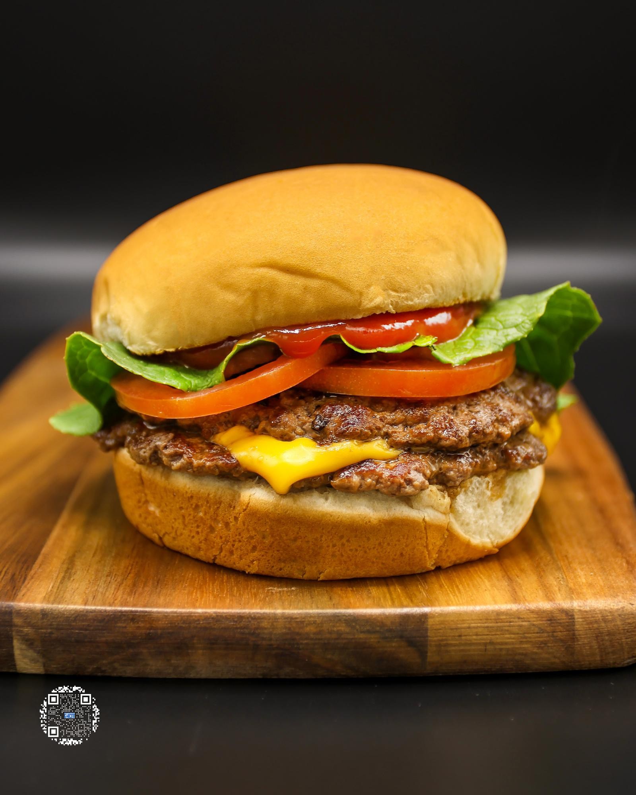

# SMASHBURGER

**Serves:** 1 | **Prep:** 5 MINS | **Cook:** 5 MINS

## Macros

| Calories | Fat | Carbs | Net Carbs | Protein |
|----------|-----|-------|-----------|---------|
| 487 | 20 | 34 | N/A | 43 |

## Ingredients

- PROTEIN BUN (or bun of choice)
- 4g unsalted butter (for bun)
- Two 70g 93% lean ground beef balls
- 5g unsalted butter (for pan)
- Salt and black pepper, to taste
- 1 slice original Velveeta® cheese
- Tomatoes, thinly sliced
- Lettuce, finely chopped
- 15g no sugar added ketchup

## Directions

1. Sandwich each ball of meat between 2 pieces of 10x10" parchment paper and flatten using a cast iron pan or another flat, heavy object.
2. Prep vegetables, spread 2g of butter on each bun, then place buns butter side down on a preheated pan on medium-high heat, and toast for 1-2 minutes.
3. Remove bun from the pan, then add 2.5g of butter and swirl it around the pan.
4. Add one patty, press into pan for 2 seconds, add salt and pepper, and let the first side cook for 1 minute or until juices have risen to the top of the patty.
5. Scrape burger off the pan, trying to keep the charred bits attached to the burger and flip it. Add cheese to the top of the patty and cook for an additional minute.
6. Place the finished patty on the toasted bottom bun, repeat steps 4 and 5 for the second patty, and place the second patty on top of the first patty.
7. Add tomatoes and lettuce directly onto the patties, put desired ketchup on top bun, and place onto the veggies for a completed burger.

## Tips

If you have a range hood or another way to ventilate your kitchen, I would utilize it. There will be a lot of smoke from the charring of the ground beef that is necessary to get that authentic smash burger taste. If you don't have a range hood, opening windows with a fan pointing towards the window would also be a great way to mitigate the smoke.

