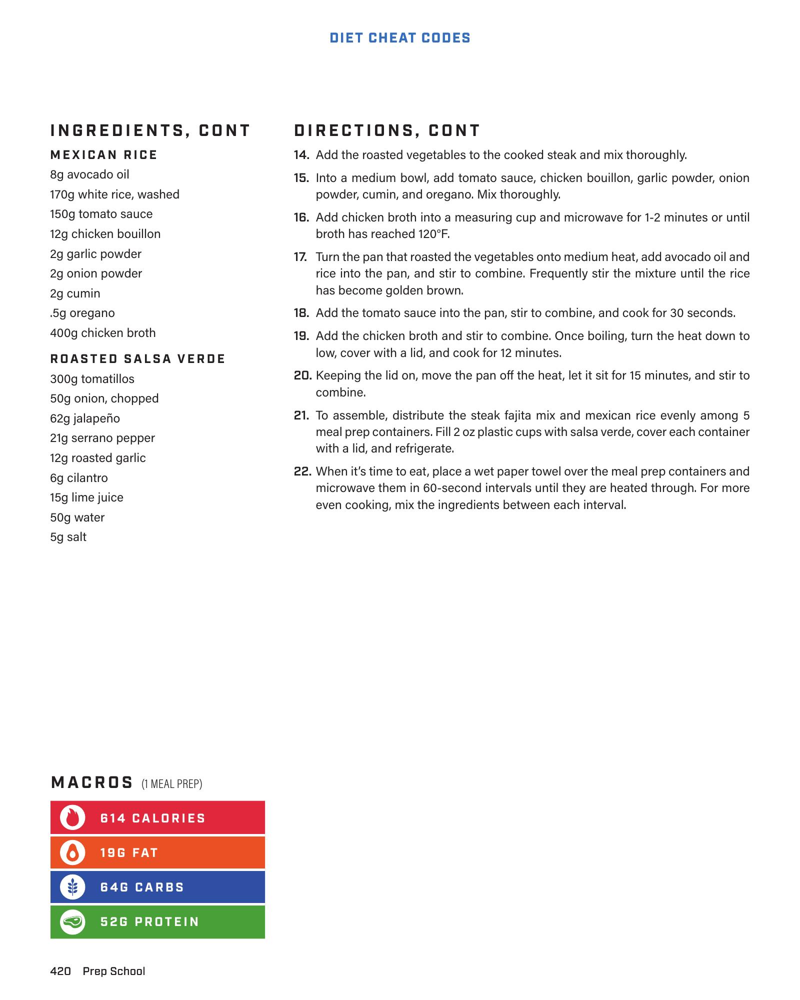

# Steak Fajita Meal Prep

**Serves:** 4 | **Prep:** 20 MINS | **Cook:** 30 MINS

## Macros

| Calories | Fat | Carbs | Net Carbs | Protein |
|----------|-----|-------|-----------|---------|
| 594 | 23 | 53 | 49 | 43 |

## Ingredients

### FAJITA SEASONING

- 2 tsp Chili powder
- 1 1/2 tsp Cumin
- 1 tsp Paprika
- 1 tsp Oregano
- 1/2 tsp Garlic powder
- 1/2 tsp Onion powder
- 1/2 tsp Salt
- 1/4 tsp Cayenne pepper

### STEAK FAJITAS

- 1.5 lb Flank steak, sliced thin
- 1 tbsp Olive oil
- 1 Green bell pepper, sliced
- 1 Red bell pepper, sliced
- 1 Yellow bell pepper, sliced
- 1 Onion, sliced
- 1/2 cup Water
- Juice of 1 lime
- Salt and pepper to taste

### MEXICAN RICE

- 1 tbsp Olive oil
- 1 cup White rice
- 1/2 cup Tomato sauce
- 2 cups Chicken broth
- 1/2 tsp Cumin
- 1/4 tsp Garlic powder
- Salt to taste

## Directions

1. In a small bowl, combine all fajita seasoning ingredients. Set aside.
2. Season the sliced flank steak with half of the fajita seasoning.
3. Heat olive oil in a large skillet or cast-iron pan over medium-high heat. Add steak and cook for 3-4 minutes until browned. Remove steak and set aside.
4. Add sliced bell peppers and onion to the same skillet. Cook for 5-7 minutes until softened.
5. Return steak to the skillet with the vegetables. Add the remaining fajita seasoning, 1/2 cup water, and lime juice. Cook for another 2-3 minutes until the liquid has mostly evaporated. Season with salt and pepper to taste.
6. For the Mexican Rice: Heat olive oil in a medium saucepan over medium heat. Add white rice and cook for 2-3 minutes, stirring constantly, until lightly toasted.
7. Stir in tomato sauce, chicken broth, cumin, and garlic powder. Bring to a boil, then reduce heat to low, cover, and simmer for 15-20 minutes, or until all liquid is absorbed and rice is tender. Season with salt to taste.
8. Divide the steak fajitas and Mexican rice among four meal prep containers. Serve with fresh salsa or guacamole, if desired.

## Tips

For a spicier kick, add an extra pinch of cayenne pepper to the fajita seasoning.

## Notes

This recipe makes 4 servings, perfect for meal prepping throughout the week.

