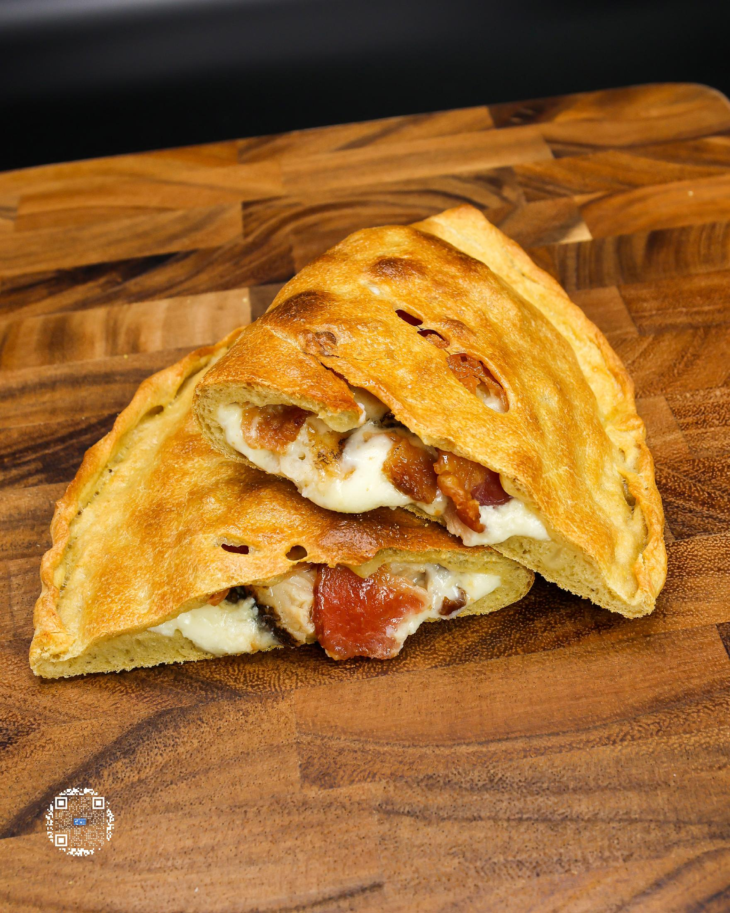
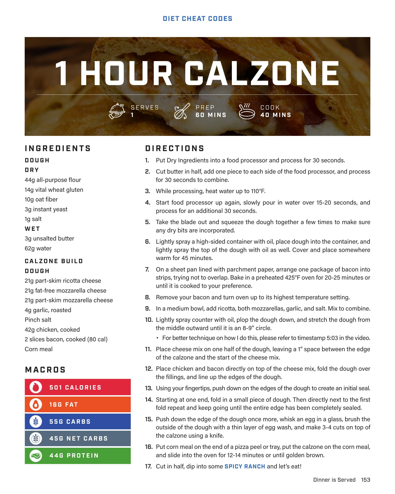

# 1 HOUR CALZONE

**Serves:** 1 | **Prep:** 60 MINS | **Cook:** 40 MINS

## Macros

| Calories | Fat | Carbs | Net Carbs | Protein |
|----------|-----|-------|-----------|---------|
| 501 | 16 | 55 | 45 | 44 |

## Ingredients

### DOUGH

- 44g all-purpose flour
- 14g vital wheat gluten
- 10g oat fiber
- 3g instant yeast
- 1g salt

### WET

- 3g unsalted butter
- 62g water

### CALZONE BUILD

- 21g part-skim ricotta cheese
- 21g fat-free mozzarella cheese
- 21g part-skim mozzarella cheese
- 4g garlic, roasted
- Pinch salt
- 42g chicken, cooked
- 2 slices bacon, cooked (80 cal)
- Corn meal

## Directions

1. Put Dry Ingredients into a food processor and process for 30 seconds.
2. Cut butter in half, add one piece to each side of the food processor, and process for 30 seconds to combine.
3. While processing, heat water up to 110°F.
4. Start food processor up again, slowly pour in water over 15-20 seconds, and process for an additional 30 seconds.
5. Take the blade out and squeeze the dough together a few times to make sure any dry bits are incorporated.
6. Lightly spray a high-sided container with oil, place dough into the container, and lightly spray the top of the dough with oil as well. Cover and place somewhere warm for 45 minutes.
7. On a sheet pan lined with parchment paper, arrange one package of bacon into strips, trying not to overlap. Bake in a preheated 425°F oven for 20-25 minutes or until it is cooked to your preference.
8. Remove your bacon and turn oven up to its highest temperature setting.
9. In a medium bowl, add ricotta, both mozzarellas, garlic, and salt. Mix to combine.
10. Lightly spray counter with oil, plop the dough down, and stretch the dough from the middle outward until it is an 8-9” circle.
11. Place cheese mix on one half of the dough, leaving a 1” space between the edge of the calzone and the start of the cheese mix.
12. Place chicken and bacon directly on top of the cheese mix, fold the dough over the fillings, and line up the edges of the dough.
13. Using your fingertips, push down on the edges of the dough to create an initial seal.
14. Starting at one end, fold in a small piece of dough. Then directly next to the first fold repeat and keep going until the entire edge has been completely sealed.
15. Push down the edge of the dough once more, whisk an egg in a glass, brush the outside of the dough with a thin layer of egg wash, and make 3-4 cuts on top of the calzone using a knife.
16. Put corn meal on the end of a pizza peel or tray, put the calzone on the corn meal, and slide into the oven for 12-14 minutes or until golden brown.
17. Cut in half, dip into some SPICY RANCH and let’s eat!

## Tips

For better technique on how I do this, please refer to timestamp 5:03 in the video.

## Additional Recipe Pages

## Source Pages

153, 154
