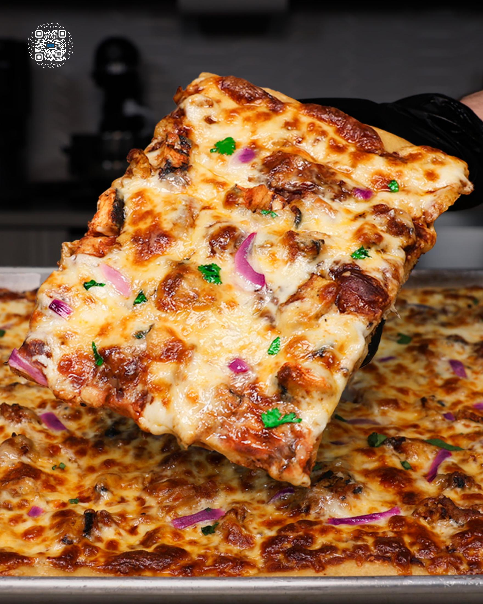
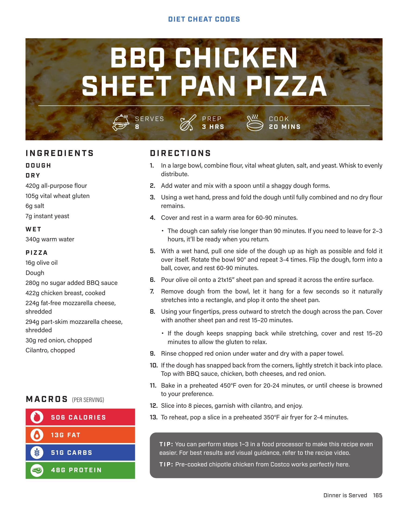

# BBQ CHICKEN SHEET PAN PIZZA

**Serves:** 8 | **Prep:** 3 HRS | **Cook:** 20 MINS

## Macros

| Calories | Fat | Carbs | Net Carbs | Protein |
|----------|-----|-------|-----------|---------|
| 506 | 13 | 51 | undefined | 48 |

## Ingredients

### DOUGH

- 420g all-purpose flour
- 105g vital wheat gluten
- 6g salt
- 7g instant yeast

### WET

- 340g warm water

### PIZZA

- 16g olive oil
- Dough
- 280g no sugar added BBQ sauce
- 422g chicken breast, cooked
- 224g fat-free mozzarella cheese, shredded
- 294g part-skim mozzarella cheese, shredded
- 30g red onion, chopped
- Cilantro, chopped

## Directions

1. In a large bowl, combine flour, vital wheat gluten, salt, and yeast. Whisk to evenly distribute.
2. Add water and mix with a spoon until a shaggy dough forms.
3. Using a wet hand, press and fold the dough until fully combined and no dry flour remains.
4. Cover and rest in a warm area for 60-90 minutes. The dough can safely rise longer than 90 minutes. If you need to leave for 2-3 hours, it'll be ready when you return.
5. With a wet hand, pull one side of the dough up as high as possible and fold it over itself. Rotate the bowl 90° and repeat 3-4 times. Flip the dough, form into a ball, cover, and rest 60-90 minutes.
6. Pour olive oil onto a 21x15" sheet pan and spread it across the entire surface.
7. Remove dough from the bowl, let it hang for a few seconds so it naturally stretches into a rectangle, and plop it onto the sheet pan.
8. Using your fingertips, press outward to stretch the dough across the pan. Cover with another sheet pan and rest 15-20 minutes. If the dough keeps snapping back while stretching, cover and rest 15-20 minutes to allow the gluten to relax.
9. Rinse chopped red onion under water and dry with a paper towel.
10. If the dough has snapped back from the corners, lightly stretch it back into place. Top with BBQ sauce, chicken, both cheeses, and red onion.
11. Bake in a preheated 450°F oven for 20-24 minutes, or until cheese is browned to your preference.
12. Slice into 8 pieces, garnish with cilantro, and enjoy.
13. To reheat, pop a slice in a preheated 350°F air fryer for 2-4 minutes.

## Tips

TIP: You can perform steps 1-3 in a food processor to make this recipe even easier. For best results and visual guidance, refer to the recipe video. TIP: Pre-cooked chipotle chicken from Costco works perfectly here.

## Additional Recipe Pages

## Source Pages

165, 166
