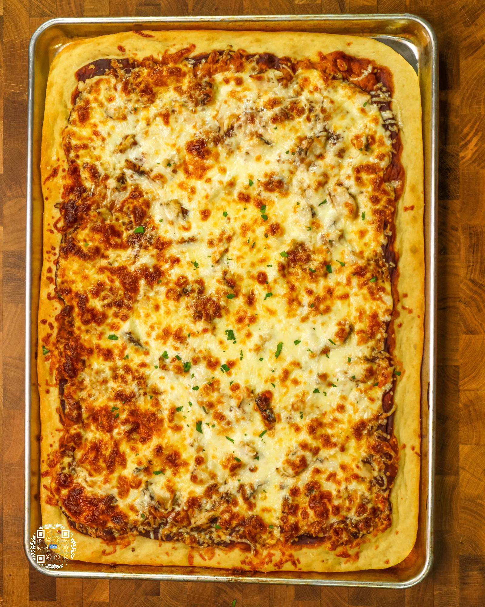

# BBQ CHICKEN SHEET PAN PIZZA

**Serves:** 8 | **Prep:** 2 HRS | **Cook:** 18 MINS

## Macros

| Calories | Fat | Carbs | Net Carbs | Protein |
|----------|-----|-------|-----------|---------|
| 430 | 11 | 46 | N/A | 39 |

## Ingredients

### DRY

- 390g all-purpose flour
- 100g vital wheat gluten
- 6g salt
- 7g instant yeast

### WET

- 15g extra virgin olive oil
- 360g water

### PIZZA

- 4g extra virgin olive oil
- Dough
- 220g no sugar added BBQ sauce
- 252g chicken breast, cooked
- 224g fat-free mozzarella cheese, shredded
- 252g part-skim mozzarella cheese, shredded
- Cilantro, chopped

## Directions

1. Add all Dry Ingredients in a food processor and process on high for 30 seconds.
2. Add olive oil onto the dry ingredients, put the top on, turn the processor on high, and slowly add water over 15-20 seconds. Continue to process for an additional 30 seconds.
3. Lightly spray a large bowl with oil, plop the dough on the counter, form into a ball, and add to the bowl. Lightly spray the top of the bowl with oil and cover for 90 minutes or until doubled in size.
4. Pour olive oil on sheet pan and spread around the entire sheet pan.
5. Take dough out of the bowl, let it hang for a couple seconds so it naturally starts stretching into a rectangular shape, and plop it onto the sheet pan.
6. Using the tips of your fingers, start stretching the dough out across the pan by pressing outwards. Cover with another sheet pan or a damp towel for 30 minutes.
7. If the corners snapped back a little bit, lightly stretch the dough back into the corners of the pan. Top the dough with BBQ sauce, chicken, fat-free cheese, and part-skim cheese.
8. Bake in a preheated 400°F oven for 16-20 minutes or until cheese begins to brown.
9. Garnish with cilantro, slice, and enjoy.

## Tips

It will not hurt the dough if it rises longer than 90 minutes as it still needs an additional rise anyway. If you need to go somewhere for 2-3 hours, your dough will be ready for you when you get back. TIP: If the dough keeps snapping back when you are stretching it in the sheet pan, cover it and let it rest for 15-20 minutes. This will allow the gluten to relax and help the dough to stretch.

