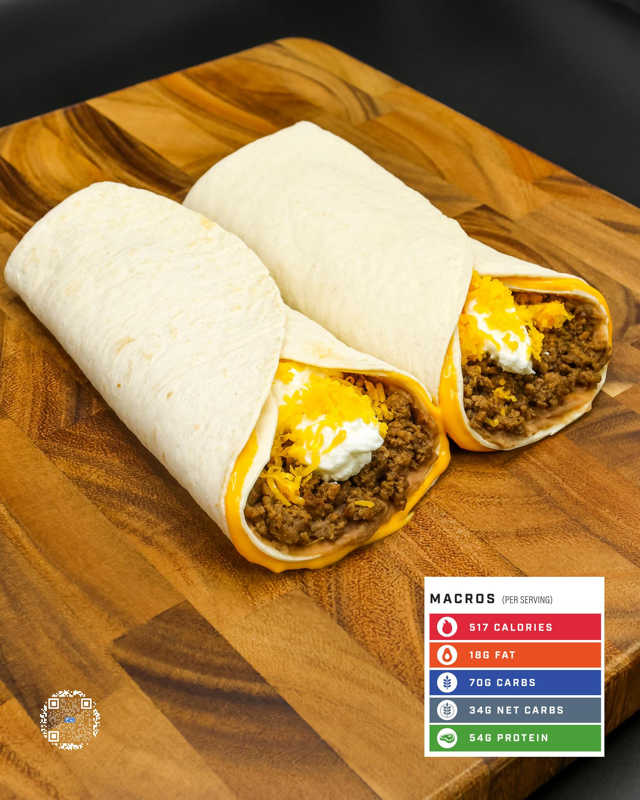

# BEEFY 5-LAYER BURRITOS

**Serves:** 3 | **Prep:** 20 MINS | **Cook:** 20 MINS

## Macros

| Calories | Fat | Carbs | Net Carbs | Protein |
|----------|-----|-------|-----------|---------|
| 517 | 18 | 70 | 34 | 54 |

## Ingredients

- 448g 96% lean ground beef

### SEASONING FOR BEEF

- 3g chili powder
- 1g garlic powder
- 1g onion powder
- 1g paprika
- 3g ground cumin
- 1g crushed red pepper flakes
- 0.5g dried oregano
- 6g salt
- 2.5g black pepper

### BEEFY 5-LAYER (Makes 2)

- 2 La Banderita® Carb Counter taco tortillas
- 2 La Banderita® Carb Counter snack tortillas
- 62g La Preferida® cheddar cheese
- 65g fat-free refried beans
- 100g cooked seasoned beef
- 60g fat-free Greek yogurt
- 14g shredded sharp cheddar cheese

## Directions

1. Add Seasoning Ingredients into small bowl and mix.
2. Place beans, La Preferida® cheddar cheese, sharp cheddar cheese, and Greek yogurt in four separate bowls.
3. Lightly spray a pan with oil, turn burner on medium, and start adding small chunks of ground beef until all beef is in the pan.
4. Once all beef is added, lightly spray the top of the meat with oil, then evenly add seasoning mix over the top. Add 15g of water to the pan.
5. Stir meat every 1-2 minutes until browned.
6. Set cooked meat aside in a container on or a plate and cover.
7. Place the taco tortillas on the counter, add La Preferida® cheddar cheese, and spread evenly across all tortillas.
8. Take the refried beans, microwave for 20 seconds, and spread evenly across the center of the snack tortillas, leaving about an inch of bare tortilla on each side.
9. Directly on top of the beans add seasoned beef, sour cream, and sharp cheddar cheese.
10. Take one side of the taco tortilla and fold it over.
11. Repeat with the other side and take 1-2 grams of the refried beans, put it on the edge of the tortilla, and stick it to the other side of the tortilla. Repeat with second taco tortilla.
12. Lay the folded snack tortillas on the middle end of the taco tortillas.
13. Take the end of the burrito tortilla and lay it on top of the taco tortilla. Then fold one side of the burrito and overlap it with the other side.
14. You now have 2 perfect beefy 5-layer burritos.
15. To get the authentic taste and texture of the drive-thru, roll each burrito in a piece of parchment paper, and throw them in the microwave for about 30 seconds.

## Tips

If you can't get the snack size tortilla, you can use a taco tortilla and cut off about an inch around it to make it the same size.

