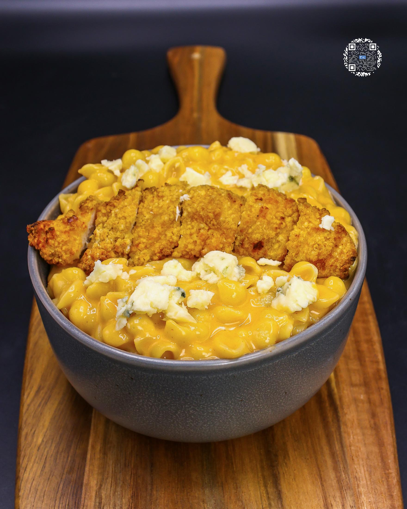
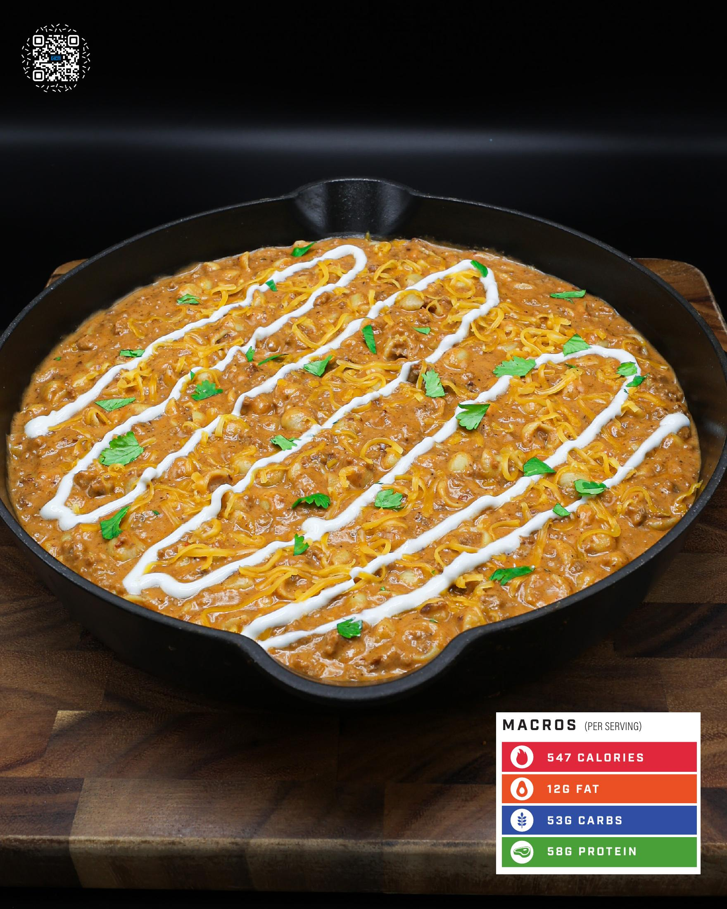

# BUFFALO MAC AND CHEESE

**Serves:** 2 | **Prep:** 5 MINS | **Cook:** 10 MINS

## Macros

| Calories | Fat | Carbs | Net Carbs | Protein |
|----------|-----|-------|-----------|---------|
| 722 | 12 | 107 | N/A | 49 |

## Ingredients

### PASTA MIXTURE

- 410g chicken broth
- 240g fat-free milk
- 224g medium shells pasta

### MIX-INS/TOPPINGS

- 56g fat-free cheddar cheese, shredded
- 126g sharp cheddar Velveeta* cheese
- 50g buffalo sauce
- 84g chicken strips (150 cal), frozen
- 14g blue cheese

## Directions

1. Add Pasta Mixture to a pot, put on the stovetop, stir to combine, and turn on high heat.
2. Set a 10-minute timer for the pasta.
3. Add chicken strips to a preheated air fryer and cook according to the instructions on the package.
4. Stir pasta more frequently as it comes to a boil to avoid burning the milk or having the noodles stick to the bottom of the pot.
5. After 10 minutes, take the pasta pot off the heat and immediately add fat-free cheese and Velveeta*. Stir for 1-2 minutes or until melted.
6. Add buffalo sauce, mix for an additional minute, and let pasta sit for 2 minutes to thicken up.
7. Give pasta a stir, pour into a bowl, top with chicken and blue cheese, and it is time to eat.

## Additional Recipe Pages

## Source Pages

109, 110, 111
