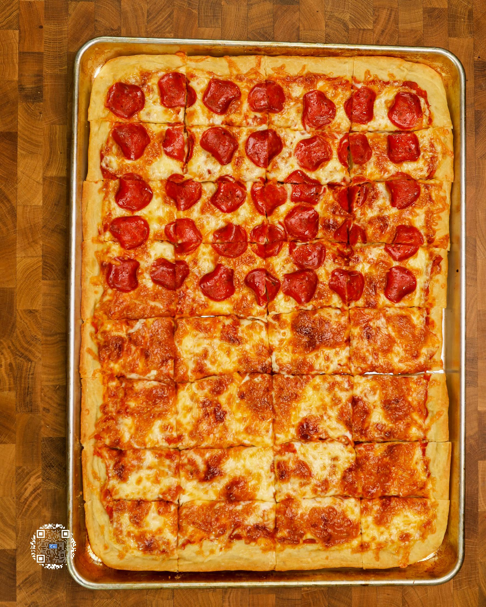
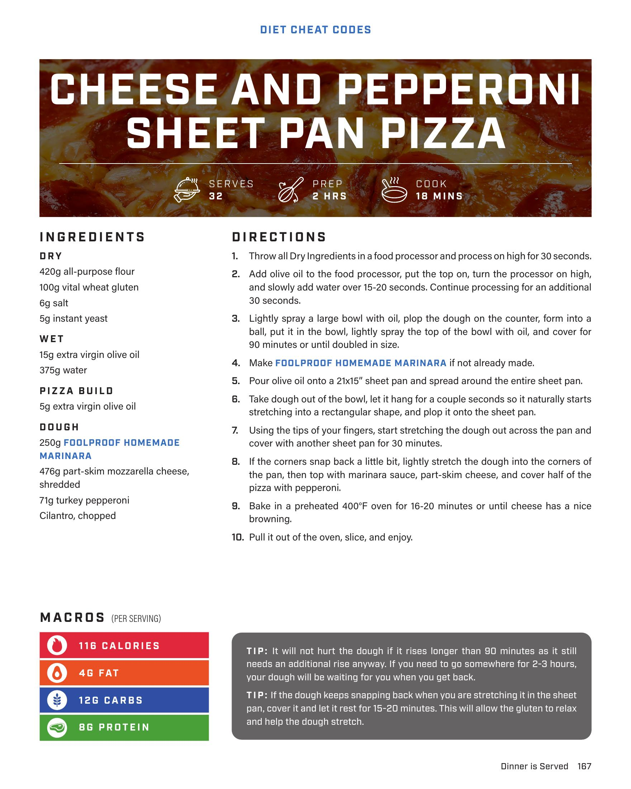

# CHEESE AND PEPPERONI SHEET PAN PIZZA

**Serves:** 32 | **Prep:** 2 HRS | **Cook:** 18 MINS

## Macros

| Calories | Fat | Carbs | Net Carbs | Protein |
|----------|-----|-------|-----------|---------|
| 116 | 4 | 12 | N/A | 8 |

## Ingredients

### DRY

- 420g all-purpose flour
- 100g vital wheat gluten
- 6g salt
- 5g instant yeast

### WET

- 15g extra virgin olive oil
- 375g water

### DOUGH

- 250g FOOLPROOF HOMEMADE MARINARA

### PIZZA BUILD

- 476g part-skim mozzarella cheese, shredded
- 71g turkey pepperoni
- Cilantro, chopped

## Directions

1. Throw all Dry Ingredients in a food processor and process on high for 30 seconds.
2. Add olive oil to the food processor, put the top on, turn the processor on high, and slowly add water over 15-20 seconds. Continue processing for an additional 30 seconds.
3. Lightly spray a large bowl with oil, plop the dough on the counter, form into a ball, put it in the bowl, lightly spray the top of the dough with oil, and cover for 90 minutes or until doubled in size.
4. Make FOOLPROOF HOMEMADE MARINARA if not already made.
5. Pour olive oil onto a 21x15" sheet pan and spread around the entire sheet pan.
6. Take dough out of the bowl, let it hang for a couple seconds so it naturally starts stretching into a rectangular shape, and plop it onto the sheet pan.
7. Using the tips of your fingers, start stretching the dough out across the pan and cover with another sheet pan for 30 minutes.
8. If the corners snap back a little bit, lightly stretch the dough into the corners of the pan, then top with marinara sauce, part-skim cheese, and cover half of the pizza with pepperoni.
9. Bake in a preheated 400°F oven for 16-20 minutes or until cheese has a nice browning.
10. Pull it out of the oven, slice, and enjoy.

## Tips

It will not hurt the dough if it rises longer than 90 minutes as it still needs an additional rise anyway. If you need to go somewhere for 2-3 hours, your dough will be waiting for you when you get back. It the dough keeps snapping back when you are stretching it in the sheet pan, cover it and let it rest for 15-20 minutes. This will allow the gluten to relax and help the dough stretch.

## Additional Recipe Pages

## Source Pages

167, 168
