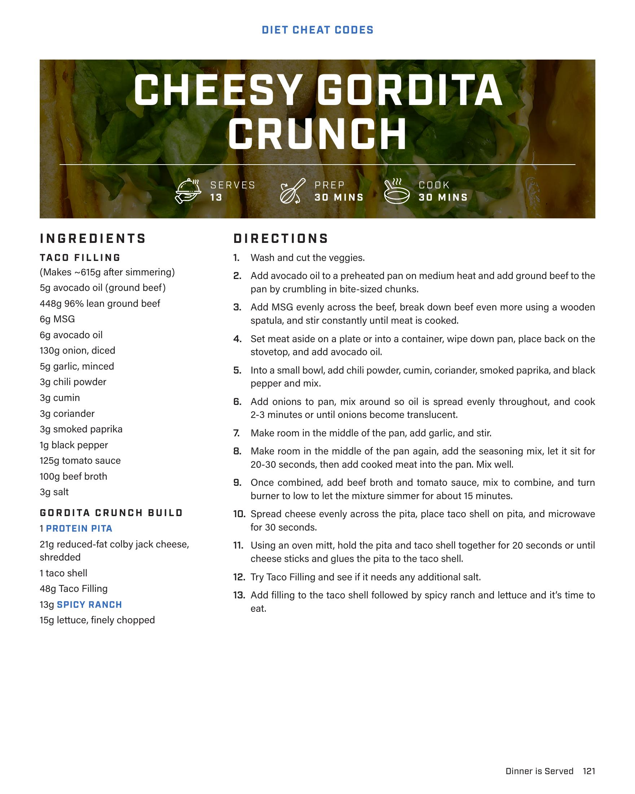
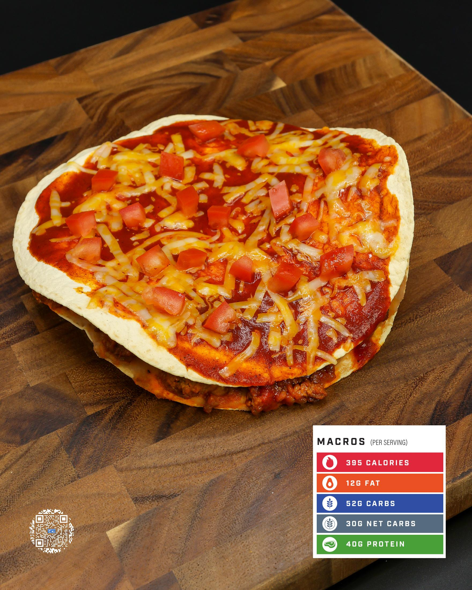

# CHEESY GORDITA CRUNCH

**Serves:** 13 | **Prep:** 30 MINS | **Cook:** 30 MINS

## Macros

| Calories | Fat | Carbs | Net Carbs | Protein |
|----------|-----|-------|-----------|---------|
| 395 | 12 | 52 | 30 | 40 |

## Ingredients

### TACO FILLING

- 5g avocado oil (ground beef)
- 448g 96% lean ground beef
- 6g MSG
- 6g avocado oil
- 130g onion, diced
- 5g garlic, minced
- 3g chili powder
- 3g cumin
- 3g coriander
- 3g smoked paprika
- 1g black pepper
- 125g tomato sauce
- 100g beef broth
- 3g salt

### GORDITA CRUNCH BUILD

- 1 PROTEIN PITA
- 21g reduced-fat colby jack cheese, shredded
- 1 taco shell
- 48g Taco Filling
- 13g SPICY RANCH
- 15g lettuce, finely chopped

## Directions

1. Wash and cut the veggies.
2. Add avocado oil to a preheated pan on medium heat and add ground beef to the pan by crumbling in bite-sized chunks.
3. Add MSG evenly across the beef, break down beef even more using a wooden spatula, and stir constantly until meat is cooked.
4. Set meat aside on a plate or into a container, wipe down pan, place back on the stovetop, and add avocado oil.
5. Into a small bowl, add chili powder, cumin, coriander, smoked paprika, and black pepper and mix.
6. Add onions to pan, mix around so oil is spread evenly throughout, and cook 2-3 minutes or until onions become translucent.
7. Make room in the middle of the pan, add garlic, and stir.
8. Make room in the middle of the pan again, add the seasoning mix, let it sit for 20-30 seconds, then add cooked meat into the pan. Mix well.
9. Once combined, add beef broth and tomato sauce, mix to combine, and turn burner to low to let the mixture simmer for about 15 minutes.
10. Spread cheese evenly across the pita, place taco shell on pita, and microwave for 20 seconds.
11. Using an oven mitt, hold the pita and taco shell together for 20 seconds or until cheese sticks and glues the pita to the taco shell.
12. Try Taco Filling and see if it needs any additional salt.
13. Add filling to the taco shell followed by spicy ranch and lettuce and it's time to eat.

## Additional Recipe Pages

## Source Pages

122, 123
