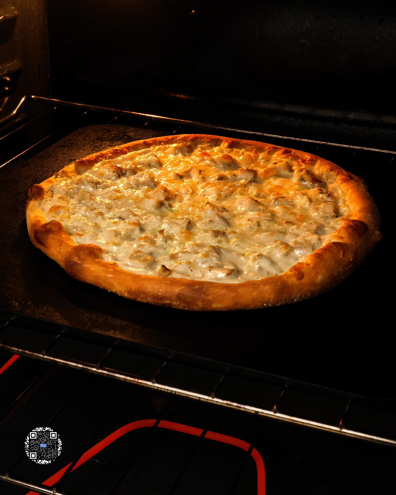
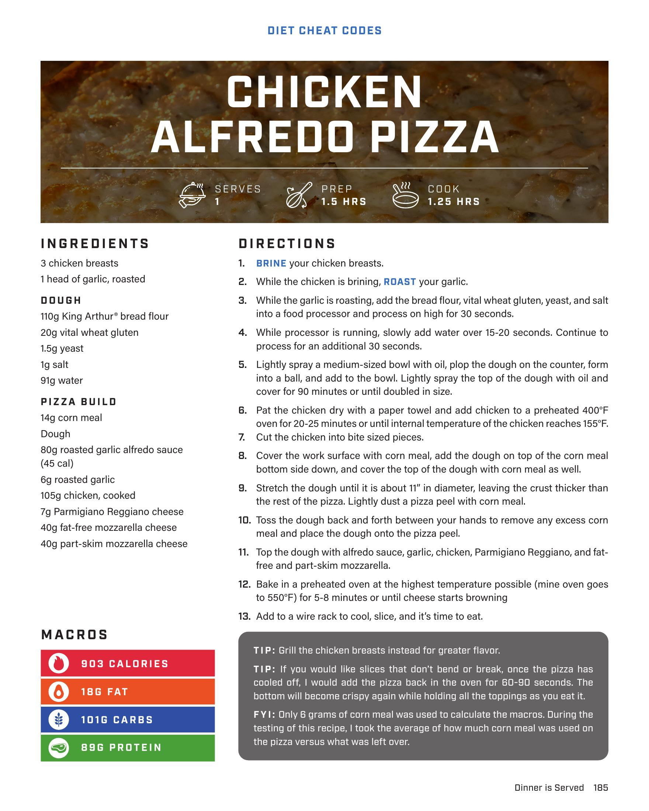

# CHICKEN ALFREDO PIZZA

**Serves:** 1 | **Prep:** 1.5 HRS | **Cook:** 1.25 HRS

## Macros

| Calories | Fat | Carbs | Net Carbs | Protein |
|----------|-----|-------|-----------|---------|
| 903 | 18 | 101 | N/A | 88 |

## Ingredients

- 3 chicken breasts
- 1 head of garlic, roasted

### DOUGH

- 10g King Arthur® bread flour
- 20g vital wheat gluten
- 1.5g yeast
- 1g salt
- 91g water

### PIZZA BUILD

- 14g corn meal
- Dough
- 80g roasted garlic alfredo sauce (45 cal)
- 6g roasted garlic
- 105g chicken, cooked
- 7g Parmigiano Reggiano cheese
- 40g fat-free mozzarella cheese
- 40g part-skim mozzarella cheese

## Directions

1. BRINE your chicken breasts.
2. While the chicken is brining, ROAST your garlic.
3. While the garlic is roasting, add the bread flour, vital wheat gluten, yeast, and salt into a food processor and process on high for 30 seconds.
4. While processor is running, slowly add water over 15-20 seconds. Continue to process for an additional 30 seconds.
5. Lightly spray a medium-sized bowl with oil, plop the dough on the counter, form into a ball, and add to the bowl. Lightly spray the top of the dough with oil and cover for 90 minutes or until doubled in size.
6. Pat the chicken dry with a paper towel and add chicken to a preheated 400°F oven for 20-25 minutes or until internal temperature of the chicken reaches 155°F. Cut the chicken into bite sized pieces.
7. Cover the work surface with corn meal, add the dough on top of the corn meal bottom side down, and cover the top of the dough with corn meal as well.
8. Stretch the dough until it is about 11" in diameter, leaving the crust thicker than the rest of the pizza. Lightly dust a pizza peel with corn meal.
9. Toss the dough back and forth between your hands to remove any excess corn meal and place the dough onto the pizza peel.
10. Top the dough with alfredo sauce, garlic, chicken, Parmigiano Reggiano, and fat-free and part-skim mozzarella.
11. Bake in a preheated oven at the highest temperature possible (mine oven goes to 550°F) for 5-8 minutes or until cheese starts browning
12. Add to a wire rack to cool, slice, and it's time to eat.

## Tips

Grill the chicken breasts instead for greater flavor. If you would like slices that don't bend or break, once the pizza has cooled off, I would add the pizza back in the oven for 60-90 seconds. The bottom will become crispy again while holding all the toppings as you eat it.

## Additional Recipe Pages

## Source Pages

185, 186
