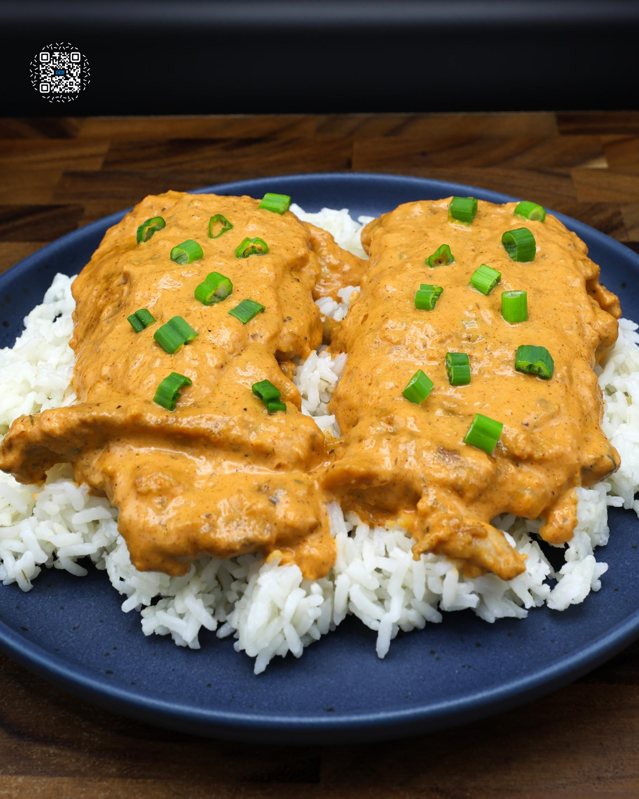
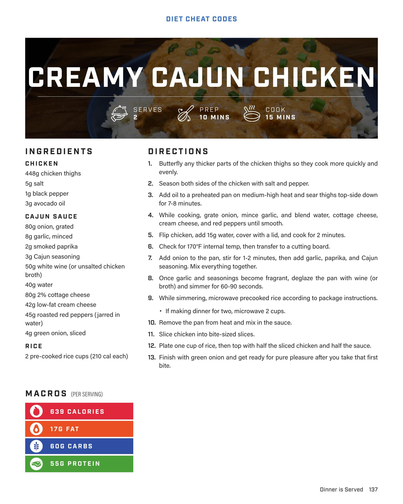

# CREAMY CAJUN CHICKEN

**Serves:** 2 | **Prep:** 10 MINS | **Cook:** 15 MINS

## Macros

| Calories | Fat | Carbs | Net Carbs | Protein |
|----------|-----|-------|-----------|---------|
| 639 | 17 | 60 | undefined | 55 |

## Ingredients

### CHICKEN

- 448g chicken thighs
- 5g salt
- 1g black pepper
- 3g avocado oil

### CAJUN SAUCE

- 80g onion, grated
- 8g garlic, minced
- 2g smoked paprika
- 3g Cajun seasoning
- 50g white wine (or unsalted chicken broth)
- 40g water
- 80g 2% cottage cheese
- 40g low-fat cream cheese
- 45g roasted red peppers (jarred in water)
- 4g green onion, sliced

### RICE

- 2 pre-cooked rice cups (210 cal each)

## Directions

1. Butterfly any thicker parts of the chicken thighs so they cook more quickly and evenly.
2. Season both sides of the chicken with salt and pepper.
3. Add oil to a preheated pan on medium-high heat and sear thighs top-side down for 7-8 minutes.
4. While cooking, grate onion, mince garlic, and blend water, cottage cheese, cream cheese, and red peppers until smooth.
5. Flip chicken, add 15g water, cover with a lid, and cook for 2 minutes.
6. Check for 170°F internal temp, then transfer to a cutting board.
7. Add onion to the pan, stir for 1-2 minutes, then add garlic, paprika, and Cajun seasoning. Mix everything together.
8. Once garlic and seasonings become fragrant, deglaze the pan with wine (or broth) and simmer for 60-90 seconds.
9. While simmering, microwave precooked rice according to package instructions. If making dinner for two, microwave 2 cups.
10. Remove the pan from heat and mix in the sauce.
11. Slice chicken into bite-sized slices.
12. Plate one cup of rice, then top with half the sliced chicken and half the sauce.
13. Finish with green onion and get ready for pure pleasure after you take that first bite.

## Additional Recipe Pages

## Source Pages

137, 138
