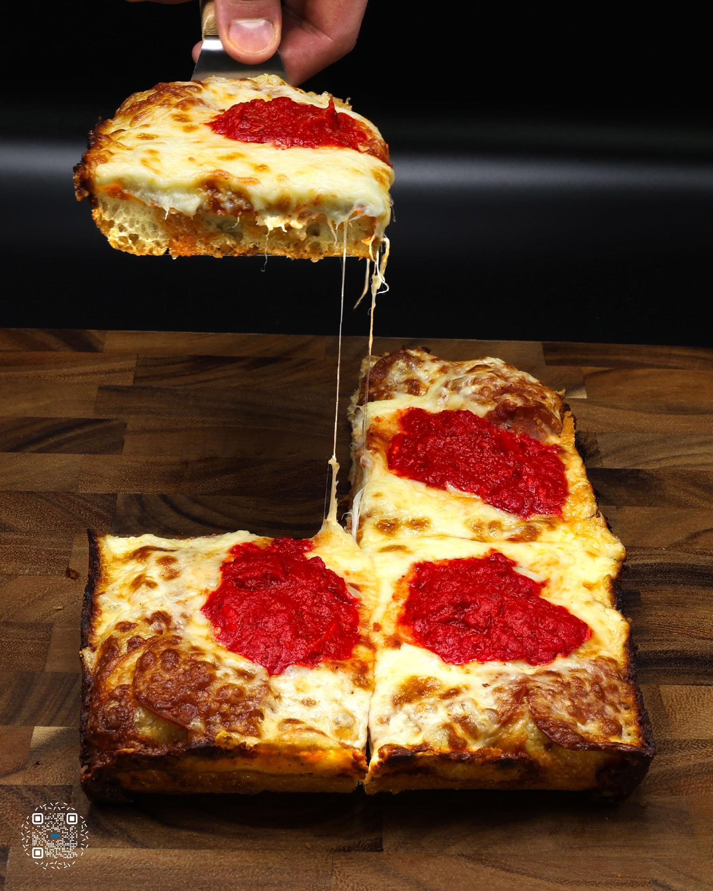
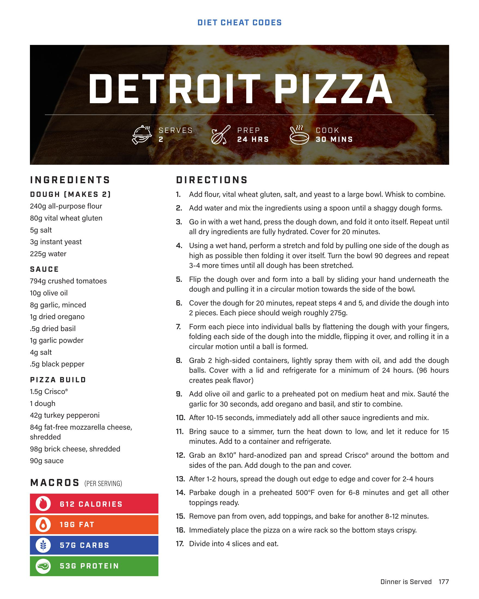

# DETROIT PIZZA

**Serves:** 2 | **Prep:** 24 HRS | **Cook:** 30 MINS

## Macros

| Calories | Fat | Carbs | Net Carbs | Protein |
|----------|-----|-------|-----------|---------|
| 612 | 19 | 57 | N/A | 53 |

## Ingredients

### DOUGH (MAKES 2)

- 240g all-purpose flour
- 80g vital wheat gluten
- 5g salt
- 3g instant yeast
- 225g water

### SAUCE

- 794g crushed tomatoes
- 10g olive oil
- 8g garlic, minced
- 1g dried oregano
- 5g dried basil
- 1g garlic powder
- 4g salt
- .5g black pepper

### PIZZA BUILD

- 1.5g Crisco®
- 1 dough
- 42g turkey pepperoni
- 84g fat-free mozzarella cheese, shredded
- 30g brick cheese, shredded
- 30g sauce

## Directions

1. Add flour, vital wheat gluten, salt, and yeast to a large bowl. Whisk to combine.
2. Add water and mix the ingredients using a spoon until a shaggy dough forms.
3. Go in with a wet hand, press the dough down, and fold it onto itself. Repeat until all dry ingredients are fully hydrated. Cover for 20 minutes.
4. Using a wet hand, perform a stretch and fold by pulling one side of the dough as high as possible then folding it over itself. Turn the bowl 90 degrees and repeat 3-4 more times until all dough has been stretched.
5. Flip the dough over and form into a ball by sliding your hand underneath the dough and pulling it in a circular motion towards the side of the bowl.
6. Cover the dough for 20 minutes, repeat steps 4 and 5, and divide the dough into 2 pieces. Each piece should weigh roughly 275g.
7. Form each piece into individual balls by flattening the dough with your fingers, folding each side of the dough into the middle, flipping it over, and rolling it in a circular motion until a ball is formed.
8. Grab 2 high-sided containers, lightly spray them with oil, and add the dough balls. Cover with a lid and refrigerate for a minimum of 24 hours. (96 hours creates peak flavor)
9. Add olive oil and garlic to a preheated pot on medium heat and mix. Sauté the garlic for 30 seconds, add oregano and basil, and stir to combine.
10. After 10-15 seconds, immediately add all other sauce ingredients and mix.
11. Bring sauce to a simmer, turn the heat down to low, and let it reduce for 15 minutes. Add to a container and refrigerate.
12. Grab an 8x10" hard-anodized pan and spread Crisco® around the bottom and sides of the pan. Add dough to the pan and cover.
13. After 1-2 hours, spread the dough out edge to edge and cover for 2-4 hours
14. Parbake dough in a preheated 500°F oven for 6-8 minutes and get all other toppings ready.
15. Remove pan from oven, add toppings, and bake for another 8-12 minutes.
16. Immediately place the pizza on a wire rack so the bottom stays crispy.
17. Divide into 4 slices and eat.

## Additional Recipe Pages

## Source Pages

177, 178
