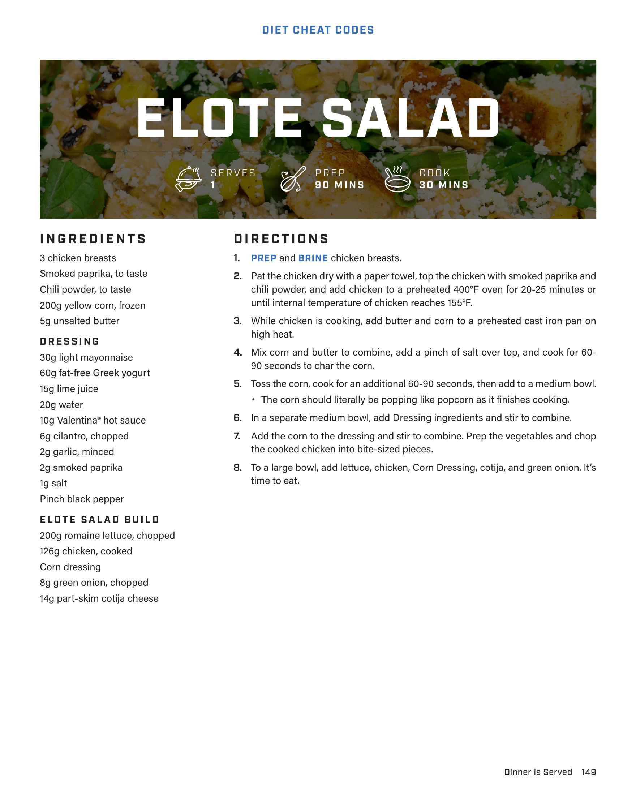

# ELOTE SALAD

**Serves:** 1 | **Prep:** 90 MINS | **Cook:** 30 MINS

## Macros

| Calories | Fat | Carbs | Net Carbs | Protein |
|----------|-----|-------|-----------|---------|
| 0 |  |  | N/A |  |

## Ingredients

- 3 chicken breasts
- Smoked paprika, to taste
- Chili powder, to taste
- 200g yellow corn, frozen
- 5g unsalted butter

### DRESSING

- 30g light mayonnaise
- 60g fat-free Greek yogurt
- 15g lime juice
- 20g water
- 10g Valentina® hot sauce
- 6g cilantro, chopped
- 2g garlic, minced
- 2g smoked paprika
- 1g salt
- Pinch black pepper

### ELOTE SALAD BUILD

- 200g romaine lettuce, chopped
- 126g chicken, cooked
- Corn dressing
- 8g green onion, chopped
- 14g part-skim cotija cheese

## Directions

1. PREP and BRINE chicken breasts.
2. Pat the chicken dry with a paper towel, top the chicken with smoked paprika and chili powder, and add chicken to a preheated 400°F oven for 20-25 minutes or until internal temperature of chicken reaches 155°F.
3. While chicken is cooking, add butter and corn to a preheated cast iron pan on high heat.
4. Mix corn and butter to combine, add a pinch of salt over top, and cook for 60-90 seconds to char the corn.
5. Toss the corn, cook for an additional 60-90 seconds, then add to a medium bowl. The corn should literally be popping like popcorn as it finishes cooking.
6. In a separate medium bowl, add Dressing ingredients and stir to combine.
7. Add the corn to the dressing and stir to combine. Prep the vegetables and chop the cooked chicken into bite-sized pieces.
8. To a large bowl, add lettuce, chicken, Corn Dressing, cotija, and green onion. It's time to eat.

## Source Pages

150
