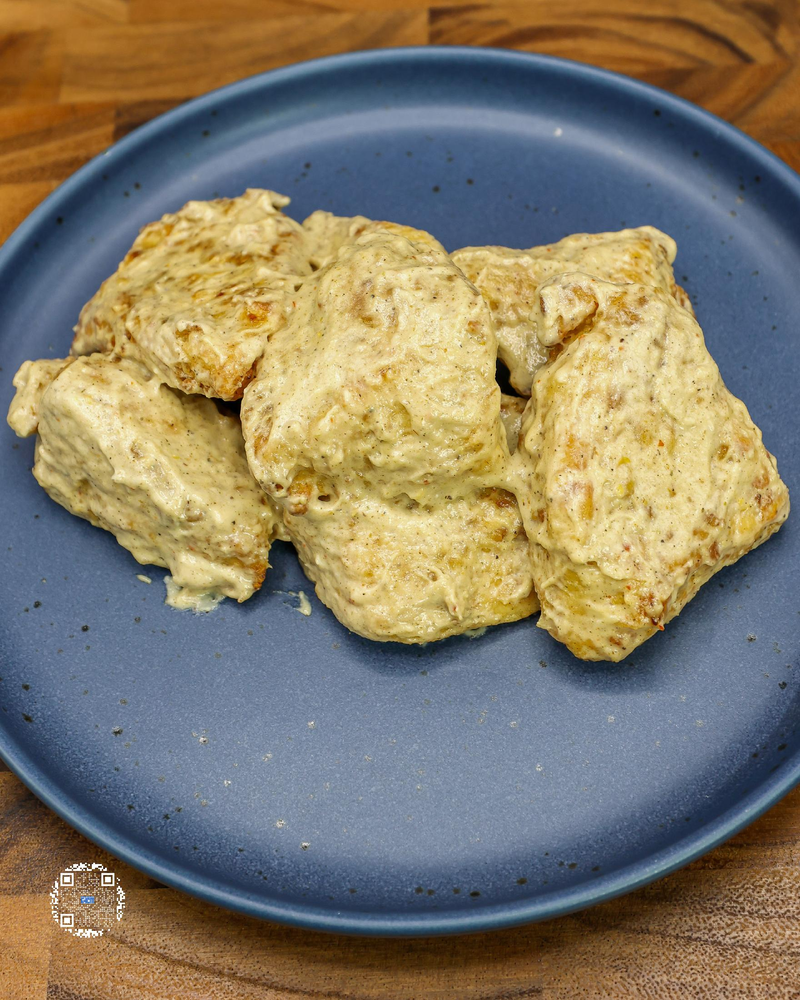
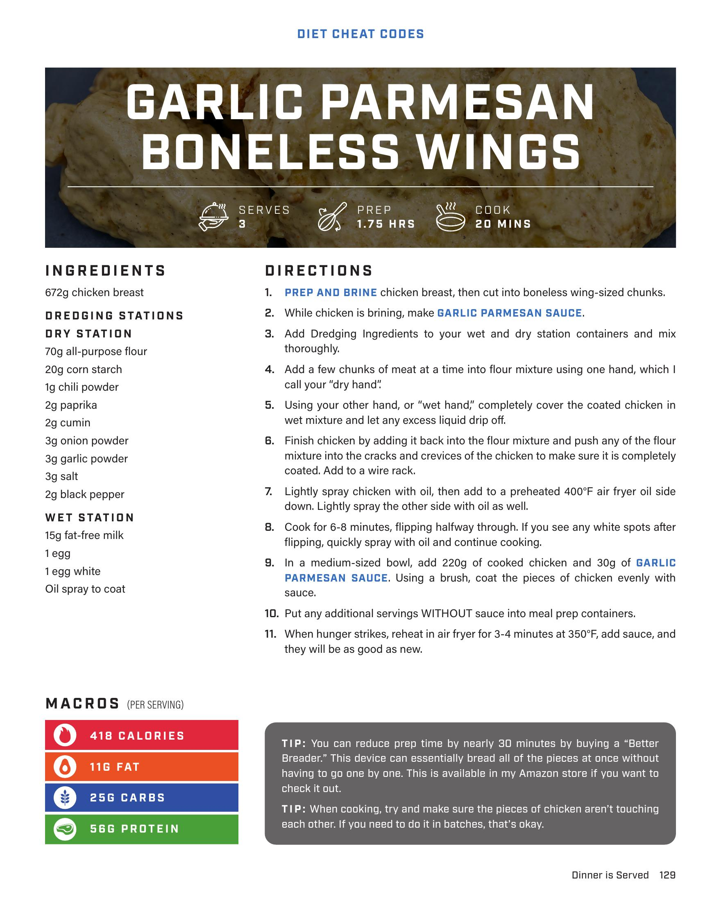
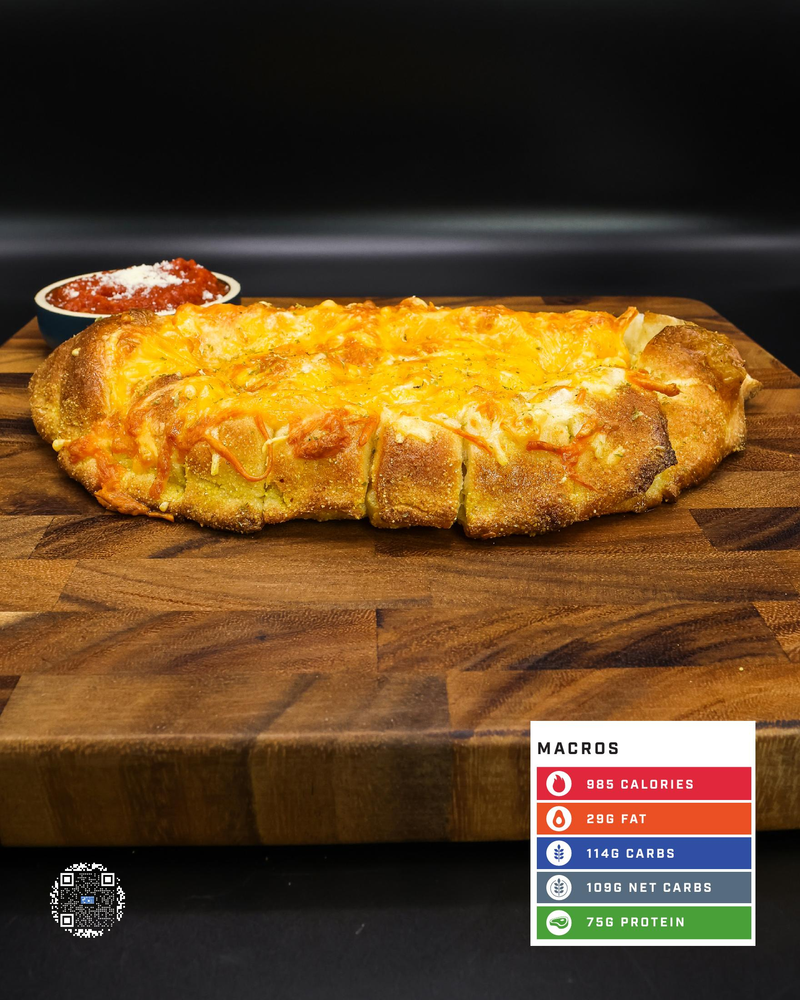

# GARLIC PARMESAN BONELESS WINGS

**Serves:** 3 | **Prep:** 1.75 HRS | **Cook:** 20 MINS

## Macros

| Calories | Fat | Carbs | Net Carbs | Protein |
|----------|-----|-------|-----------|---------|
| 418 | 11 | 25 | N/A | 56 |

## Ingredients

- 672g chicken breast

### DREDGING STATIONS

- 70g all-purpose flour
- 20g corn starch
- 1g chili powder
- 2g paprika
- 2g cumin
- 3g onion powder
- 3g garlic powder
- 3g salt
- 2g black pepper

### WET STATION

- 15g fat-free milk
- 1 egg
- 1 egg white
- Oil spray to coat

## Directions

1. PREP AND BRINE chicken breast, then cut into boneless wing-sized chunks.
2. While chicken is brining, make GARLIC PARMESAN SAUCE.
3. Add Dredging Ingredients to your wet and dry station containers and mix thoroughly.
4. Add a few chunks of meat at a time into flour mixture using one hand, which I call your "dry hand".
5. Using your other hand, or "wet hand," completely cover the coated chicken in wet mixture and let any excess liquid drip off.
6. Finish chicken by adding it back into the flour mixture and push any of the flour mixture into the cracks and crevices of the chicken to make sure it is completely coated. Add to a wire rack.
7. Lightly spray chicken with oil, then add to a preheated 400°F air fryer oil side down. Lightly spray the other side with oil as well.
8. Cook for 5-6 minutes, flipping halfway through. If you see any white spots after flipping, quickly spray with oil and continue cooking.
9. In a medium-sized bowl, add 220g of cooked chicken and 30g of GARLIC PARMESAN SAUCE. Using a brush, coat the pieces of chicken evenly with sauce.
10. Put any additional servings WITHOUT sauce into meal prep containers.
11. When hunger strikes, reheat in air fryer for 3-4 minutes at 350°F, add sauce, and they will be good as new.

## Tips

You can reduce prep time by nearly 30 minutes by buying a "Better Breader". This device can essentially bread all of the pieces at once without having to go one by one. This is available in my Amazon store if you want to check it out. When cooking, try and make sure the pieces of chicken aren't touching each other. If you need to do it in batches, that's okay.

## Additional Recipe Pages

## Source Pages

129, 130, 131
