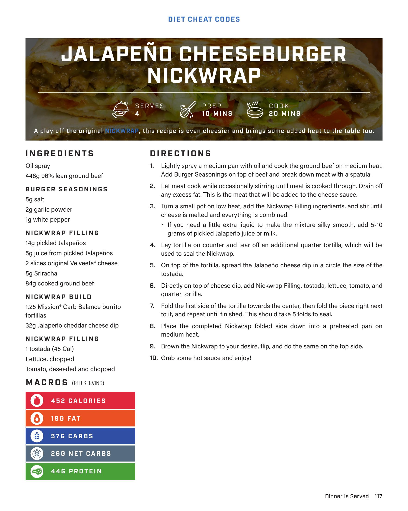
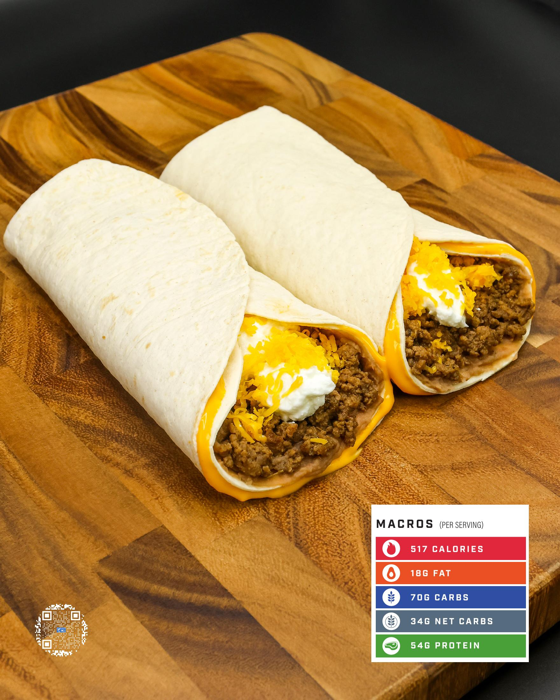

# JALAPEÑO CHEESEBURGER NICKWRAP

**Serves:** 4 | **Prep:** 10 MINS | **Cook:** 20 MINS

## Macros

| Calories | Fat | Carbs | Net Carbs | Protein |
|----------|-----|-------|-----------|---------|
| 452 | 19 | 57 | 26 | 44 |

## Ingredients

- Oil spray
- 448g 96% lean ground beef

### BURGER SEASONINGS

- 5g salt
- 2g garlic powder
- 1g white pepper

### NICKWRAP FILLING

- 14g pickled jalapeños
- 5g juice from pickled jalapeños
- 2 slices original Velveta® cheese
- 5g Sriracha
- 84g cooked ground beef

### NICKWRAP BUILD

- 1.25 Mission® Carb Balance burrito tortillas
- 32g jalapeño cheddar cheese dip

### NICKWRAP FILLING

- 1 tostada (45 Cal)
- Lettuce, chopped
- Tomato, deseeded and chopped

## Directions

1. Lightly spray a medium pan with oil and cook the ground beef on medium heat. Add Burger Seasonings on top of beef and break down meat with a spatula.
2. Let meat cook while occasionally stirring until meat is cooked through. Drain off any excess fat. This is the meat that will be added to the cheese sauce.
3. Turn a small pot on low heat, add the Nickwrap Filling ingredients, and stir until cheese is melted and everything is combined. If you need a little extra liquid to make the mixture silky smooth, add 5-10 grams of pickled jalapeño juice or milk.
4. Lay tortilla on counter, and tear off an additional quarter tortilla, which will be used to seal the Nickwrap.
5. On top of the tortilla, spread the jalapeño cheese dip in a circle the size of the tostada.
6. Directly on top of cheese dip, add Nickwrap Filling, tostada, lettuce, tomato, and quarter tortilla.
7. Fold the first side of the tortilla towards the center, then fold the piece right next to it, and repeat until finished. This should take 5 folds to seal.
8. Place the completed Nickwrap folded side down into a preheated pan on medium heat.
9. Brown the Nickwrap to your desire, flip, and do the same on the top side.
10. Grab some hot sauce and enjoy!

## Additional Recipe Pages

## Source Pages

117, 118, 119
