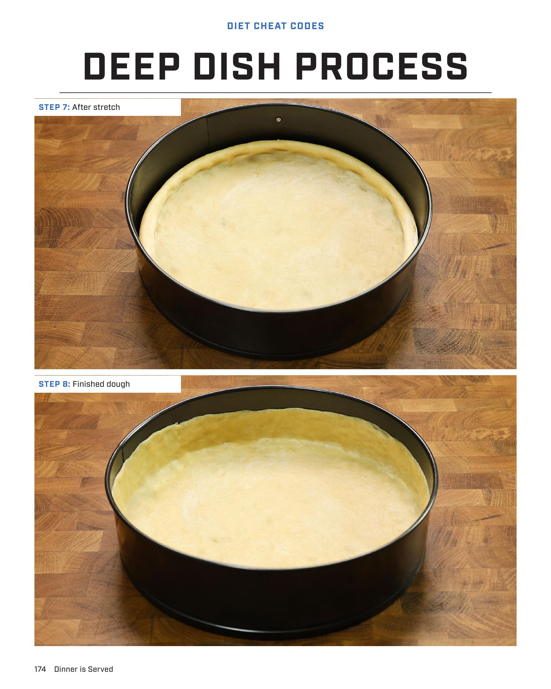
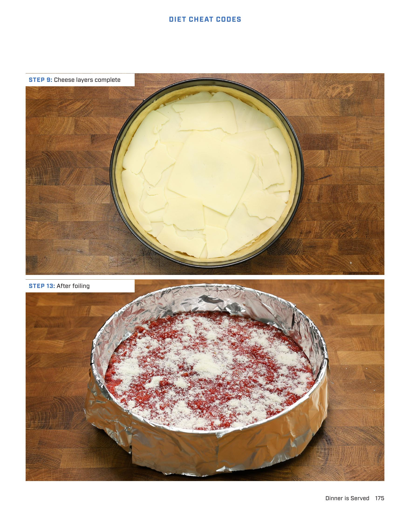

# LOU'S SAUSAGE DEEP DISH PIZZA

**Serves:** 6 | **Prep:** 24 HRS | **Cook:** 30 MINS

## Macros

| Calories | Fat | Carbs | Net Carbs | Protein |
|----------|-----|-------|-----------|---------|
| 0 |  |  | undefined |  |

## Ingredients

### DRY

- 160g all-purpose flour
- 30g vital wheat gluten
- 1g instant yeast
- 2g salt

### WET

- 25g corn oil
- 5g olive oil
- 90g water

### ITALIAN SAUSAGE

- 448g 90% lean ground pork
- 9g salt
- 2g black pepper
- 1.5g garlic powder

### PIZZA BUILD

- 1.5g Crisco®
- 1 dough
- 140g fat-free mozzarella cheese, shredded
- 168g whole milk low moisture mozzarella cheese, thinly sliced
- 280g sausage
- 180g 3 in 1 ground tomatoes
- 5g pecorino romano, grated
- 5g Parmigiano-Reggiano, grated
- Pinch dried oregano

## Directions

1. Place dry ingredients into a food processor and mix for 60 seconds.
2. Add corn oil and olive oil into processor and blend on high for 10 seconds. While blending, slowly add water over a 15-20 second period and continue blending for an additional 20 seconds.
3. Place dough on the counter. Use a piece of the dough to scrape up any ingredients that remain in the food processor.
4. Knead the ingredients into the dough for one minute, place in a bowl, cover with cling wrap, and refrigerate for 24-48 hours.
5. Top the ground pork with salt, black pepper, and garlic powder and knead the seasonings into the meat for 2-3 minutes. Place the sausage in a bowl, cover with cling wrap, and refrigerate for 24-48 hours.
6. Take dough out of the fridge 2-3 hours before cooking to rise. Spread Crisco® in a 10" springform pan, making sure the bottom and sides are completely covered.
7. Add dough into the pan and stretch the dough edge to edge, making sure the outside edge of the dough is thicker than the rest of the dough.
8. Using your fingertips, bring the edge of the dough 1" up the pan. The dough along the edge of the pan should be very thin.
9. Add fat-free mozzarella on top of the dough. Then overlap the whole milk mozzarella slices along the edge of the pan, followed by another piece placed in the middle. Evenly distribute any remaining slices.
10. Place pieces of sausage throughout the pan and push the pieces into the cheese to ensure a thin layer of sausage once finished. I like start on the edge of the pan and work my way in.
11. Add sauce onto the middle of the pizza and push the sauce out to the edges.
12. Mix the parmesan, romano, and oregano in a small bowl. Spread across the pizza.
13. Using 3"x4" pieces of aluminum foil, cover the pizza crust at the sauce line and wrap any extra foil around the top of the pan.
14. Bake pizza in a preheated 450°F oven for 25-30 minutes.
15. Remove from the oven and immediately place the pizza on a wire rack. Let cool for 5 minutes before slicing into 6 pieces and eating the shit out of it.

## Additional Recipe Pages

## Source Pages

174, 175, 176
