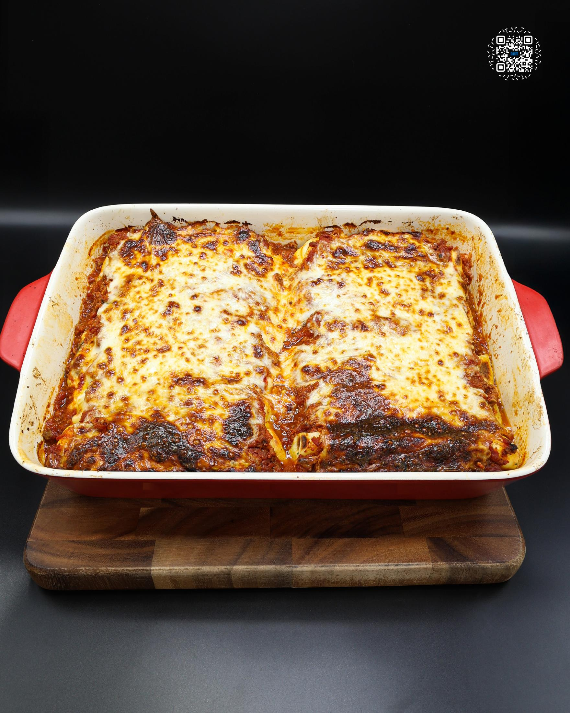
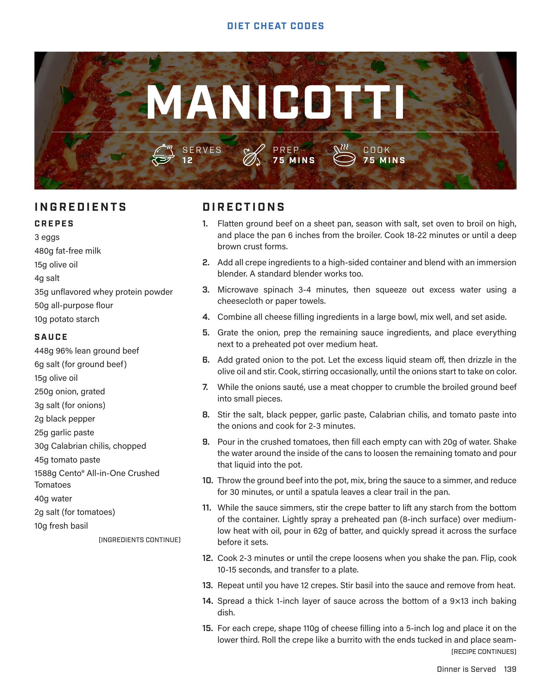
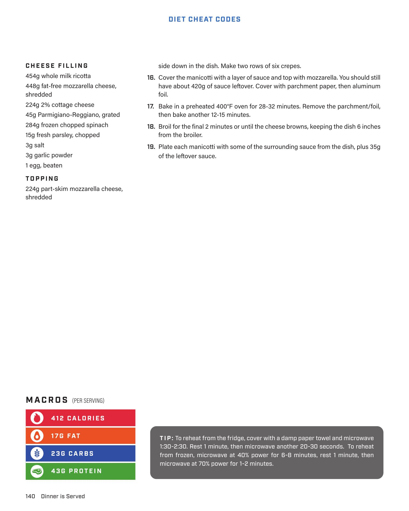
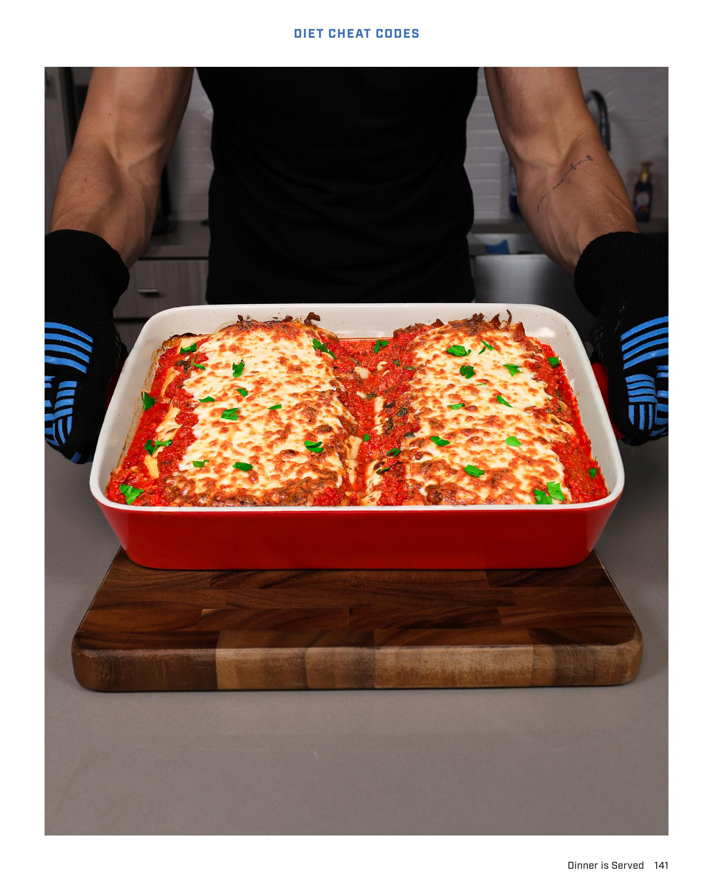
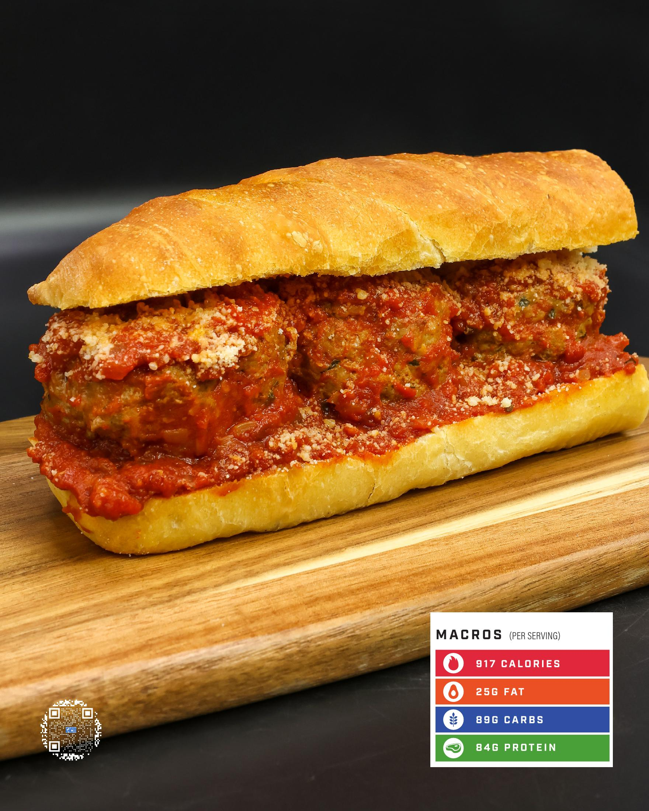

# MANICOTTI

**Serves:** 12 | **Prep:** 75 MINS | **Cook:** 75 MINS

## Macros

| Calories | Fat | Carbs | Net Carbs | Protein |
|----------|-----|-------|-----------|---------|
| 412 | 17 | 23 | undefined | 43 |

## Ingredients

### CREPES

- 3 eggs
- 480g fat-free milk
- 15g olive oil
- 4g salt
- 35g unflavored whey protein powder
- 50g all-purpose flour
- 10g potato starch

### SAUCE

- 448g 96% lean ground beef
- 6g salt (for ground beef)
- 15g olive oil
- 250g onion, grated
- 3g salt (for onions)
- 2g black pepper
- 25g garlic paste
- 30g Calabrian chilis, chopped
- 45g tomato paste
- 158g Cento® All-in-One Crushed Tomatoes
- 40g water
- 2g salt (for tomatoes)
- 10g fresh basil

### CHEESE FILLING

- 454g whole milk ricotta
- 448g fat-free mozzarella cheese, shredded
- 224g 2% cottage cheese
- 45g Parmigiano-Reggiano, grated
- 284g frozen chopped spinach
- 15g fresh parsley, chopped
- 3g salt
- 3g garlic powder
- 1 egg, beaten

### TOPPING

- 224g part-skim mozzarella cheese, shredded

## Directions

1. Flatten ground beef on a sheet pan, season with salt, set oven to broil on high, and place the pan 6 inches from the broiler. Cook 18-22 minutes or until a deep brown crust forms.
2. Add all crepe ingredients to a high-sided container and blend with an immersion blender. A standard blender works too.
3. Microwave spinach 3-4 minutes, then squeeze out excess water using a cheesecloth or paper towels.
4. Combine all cheese filling ingredients in a large bowl, mix well, and set aside.
5. Grate the onion, prep the remaining sauce ingredients, and place everything next to a preheated pot over medium heat.
6. Add ground onion to the pot. Let the excess liquid steam off, then drizzle in the olive oil and salt. Cook, stirring occasionally, until the onions start to take on color.
7. While the onions sauté, use a meat chopper to crumble the broiled ground beef into small pieces.
8. Stir the salt, black pepper, garlic paste, Calabrian chilis, and tomato paste into the onions and cook for 2-3 minutes.
9. Pour in the crushed tomatoes, then fill each empty can with 20g of water. Shake the water around the inside of the cans to loosen the remaining tomato and pour that liquid into the pot.
10. Throw the ground beef into the pot, mix, bring the sauce to a simmer, and reduce for 30 minutes, or until a spatula leaves a clear trail in the pan.
11. While the sauce simmers, stir the crepe batter to lift any starch from the bottom of the container. Lightly spray a preheated pan (8-inch surface) over medium-low heat with oil, pour in 62g of batter, and quickly spread it across the surface before it sets.
12. Cook 2-3 minutes or until the crepe loosens when you shake the pan. Flip, cook 10-15 seconds, and transfer to a plate.
13. Repeat until you have 12 crepes. Stir basil into the sauce and remove from heat.
14. Spread a thick 1-inch layer of sauce across the bottom of a 9x13 inch baking dish.
15. For each crepe, shape 110g of cheese filling into a 5-inch log and place it on the lower third. Roll the crepe like a burrito with the ends tucked in and place seam-side down in the dish. Make two rows of six crepes.
16. Cover the manicotti with a layer of sauce and top with mozzarella. You should still have about 420g of sauce leftover. Cover with parchment paper, then aluminum foil.
17. Bake in a preheated 400°F oven for 20-32 minutes. Remove the parchment/foil, then bake another 12-15 minutes.
18. Broil for the final 2 minutes or until the cheese browns, keeping the dish 6 inches from the broiler.
19. Plate each manicotti with some of the surrounding sauce from the dish, plus 35g of the leftover sauce.

## Tips

To reheat from the fridge, cover with a damp paper towel and microwave 1:30-2:30. Rest 1 minute, then microwave another 20-30 seconds. To reheat from frozen, microwave at 40% power for 6-8 minutes, rest 1 minute, then microwave at 70% power for 1-2 minutes.

## Additional Recipe Pages

## Source Pages

139, 140, 141, 142, 143
