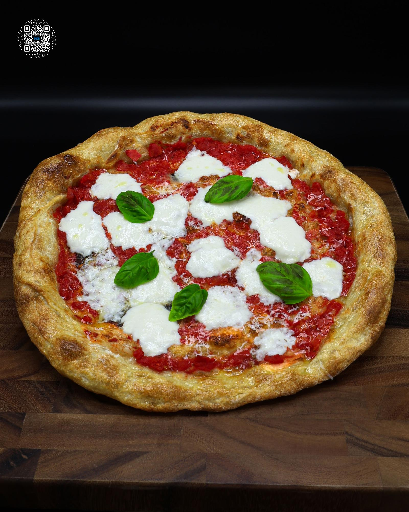

# MARGHERITA PIZZA

**Serves:** 2 | **Prep:** 24 HRS | **Cook:** 10 MINS

## Macros

| Calories | Fat | Carbs | Net Carbs | Protein |
|----------|-----|-------|-----------|---------|
| 649 | 20 | 80 | N/A | 39 |

## Ingredients

### DRY

- 190g 00 flour
- 40g vital wheat gluten
- 5g salt
- 3g instant yeast

### WET

- 170g water

### PIZZA BUILD

- 1 dough
- 70g 6 in 1 ground tomatoes
- 60g fresh mozzarella
- 5g Parmigiano Reggiano
- 5g olive oil
- 3g fresh basil

## Directions

1. In a large bowl, whisk the dry ingredients together. Add water and mix with a spoon until a shaggy dough forms.
2. Use a wet hand to press and fold the dough until fully combined and no dry parts remain. Cover and rest for 20 minutes.
3. With a wet hand, pull one side of the dough up as high as possible and fold it over itself. Rotate the bowl 90°, repeating 3-4 times. Flip the dough, form a ball, and cover for another 20 minutes.
4. Repeat step 3.
5. Divide the dough into 2 pieces, each about 200g.
6. Flatten each piece, fold the edges into the center, flip, and shape into a ball by pulling it toward yourself. Rotate 90° and repeat until smooth.
7. Place each dough ball in a lightly oiled, high-sided container, cover, and refrigerate for 24-48 hours.
8. Two to three hours before baking, let the dough rise on the counter and reach room temperature.
9. Lightly flour your surface. Place dough on the flour and dust the top.
10. Outline the crust with your fingers. Press outward from the center of the dough until it is about 6" wide. If sticking occurs, add more flour and continue stretching.
11. Lift the dough (avoiding the crust) and stretch it with your fists in a circular motion until 9-11 inches wide.
12. Place the stretched dough on parchment paper and top with tomatoes.
13. Bake on a preheated pizza steel at 550°F for 4-5 minutes. Remove, pat mozzarella dry with paper towel, and add to the pizza.
14. Bake for an additional 2-3 minutes or until the cheese bubbles.
15. Finish the pizza with Parmigiano Reggiano, olive oil (on both the toppings and crust), and basil. Serve immediately and enjoy!

## Tips

You can substitute 00 flour with all-purpose flour and use your preferred tomatoes.

