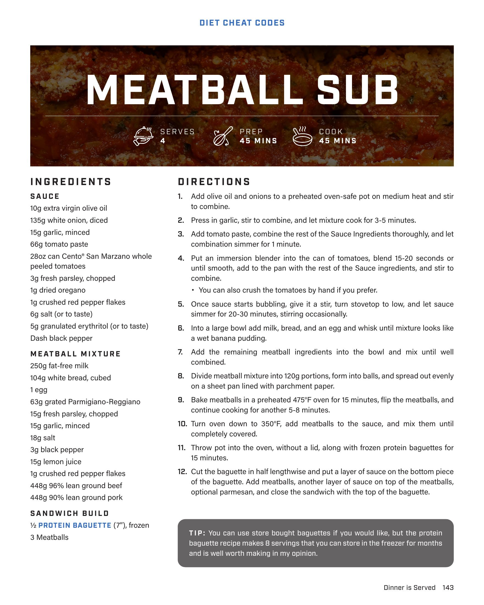

# MEATBALL SUB

**Serves:** 4 | **Prep:** 45 MINS | **Cook:** 45 MINS

## Macros

| Calories | Fat | Carbs | Net Carbs | Protein |
|----------|-----|-------|-----------|---------|
| 0 |  |  | N/A |  |

## Ingredients

### SAUCE

- 10g extra virgin olive oil
- 135g white onion, diced
- 15g garlic, minced
- 66g tomato paste
- 28oz can Cento® San Marzano whole peeled tomatoes
- 3g fresh parsley, chopped
- 1g dried oregano
- 1g crushed red pepper flakes
- 6g salt (or to taste)
- 5g granulated erythritol (or to taste)
- Dash black pepper

### MEATBALL MIXTURE

- 250g fat-free milk
- 104g white bread, cubed
- 1 egg
- 63g grated Parmigiano-Reggiano
- 15g fresh parsley, chopped
- 15g garlic, minced
- 18g salt
- 3g black pepper
- 15g lemon juice
- 1g crushed red pepper flakes
- 448g 96% lean ground beef
- 448g 90% lean ground pork

### SANDWICH BUILD

- ½ PROTEIN BAGUETTE (7"), frozen
- 3 Meatballs

## Directions

1. Add olive oil and onions to a preheated oven-safe pot on medium heat and stir to combine.
2. Press in garlic, stir to combine, and let mixture cook for 3-5 minutes.
3. Add tomato paste, combine the rest of the Sauce Ingredients thoroughly, and let combination simmer for 1 minute.
4. Put an immersion blender into the can of tomatoes, blend 15-20 seconds or until smooth, add to the pan with the rest of the Sauce ingredients, and stir to combine. You can also crush the tomatoes by hand if you prefer.
5. Once sauce starts bubbling, give it a stir, turn stovetop to low, and let sauce simmer for 20-30 minutes, stirring occasionally.
6. Into a large bowl add milk, bread, and an egg and whisk until mixture looks like a wet banana pudding.
7. Add the remaining meatball ingredients into the bowl and mix until well combined.
8. Divide meatball mixture into 120g portions, form into balls, and spread out evenly on a sheet pan lined with parchment paper.
9. Bake meatballs in a preheated 475°F oven for 15 minutes, flip the meatballs, and continue cooking for another 5-8 minutes.
10. Turn oven down to 350°F, add meatballs to the sauce, and mix them until completely covered.
11. Throw pot into the oven, without a lid, along with frozen protein baguettes for 15 minutes.
12. Cut the baguette in half lengthwise and put a layer of sauce on the bottom piece of the baguette. Add meatballs, another layer of sauce on top of the meatballs, optional parmesan, and close the sandwich with the top of the baguette.

## Tips

You can use store bought baguettes if you would like, but the protein baguette recipe makes 8 servings that you can store in the freezer for months and is well worth making in my opinion.

## Source Pages

144
