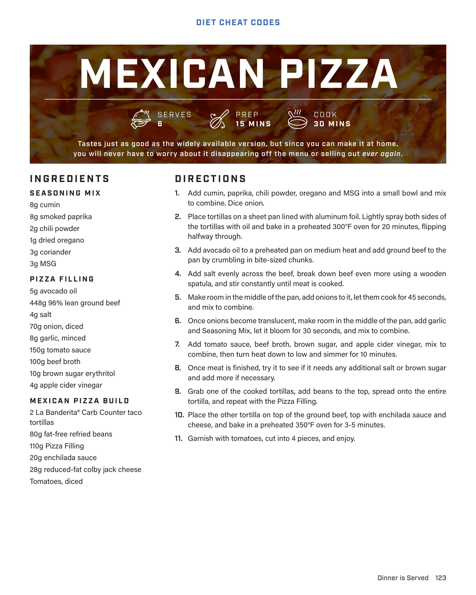

# MEXICAN PIZZA

**Serves:** 6 | **Prep:** 15 MINS | **Cook:** 30 MINS

## Macros

| Calories | Fat | Carbs | Net Carbs | Protein |
|----------|-----|-------|-----------|---------|
| 0 |  |  | undefined |  |

## Ingredients

### SEASONING MIX

- 8g cumin
- 8g smoked paprika
- 2g chili powder
- 1g dried oregano
- 3g coriander
- 3g MSG

### PIZZA FILLING

- 5g avocado oil
- 448g 96% lean ground beef
- 4g salt
- 70g onion, diced
- 8g garlic, minced
- 150g tomato sauce
- 100g beef broth
- 10g brown sugar erythritol
- 4g apple cider vinegar

### MEXICAN PIZZA BUILD

- 2 La Banderita® Carb Counter taco tortillas
- 80g fat-free refried beans
- 110g Pizza Filling
- 20g enchilada sauce
- 28g reduced-fat colby jack cheese
- Tomatoes, diced

## Directions

1. Add cumin, paprika, chili powder, oregano and MSG into a small bowl and mix to combine. Dice onion.
2. Place tortillas on a sheet pan lined with aluminum foil. Lightly spray both sides of the tortillas with oil and bake in a preheated 300°F oven for 20 minutes, flipping halfway through.
3. Add avocado oil to a preheated pan on medium heat and add ground beef to the pan by crumbling in bite-sized chunks.
4. Add salt evenly across the beef, break down beef even more using a wooden spatula, and stir constantly until meat is cooked.
5. Make room in the middle of the pan, add onions to it, let them cook for 45 seconds, and mix to combine.
6. Once onions become translucent, make room in the middle of the pan, add garlic and Seasoning Mix, let it bloom for 30 seconds, and mix to combine.
7. Add tomato sauce, beef broth, brown sugar, and apple cider vinegar, mix to combine, then turn heat down to low and simmer for 10 minutes.
8. Once meat is finished, try it to see if it needs any additional salt or brown sugar and add more if necessary.
9. Grab one of the cooked tortillas, add beans to the top, spread onto the entire tortilla, and repeat with the Pizza Filling.
10. Place the other tortilla on top of the ground beef, top with enchilada sauce and cheese, and bake in a preheated 350°F oven for 3-5 minutes.
11. Garnish with tomatoes, cut into 4 pieces, and enjoy.

## Source Pages

124
