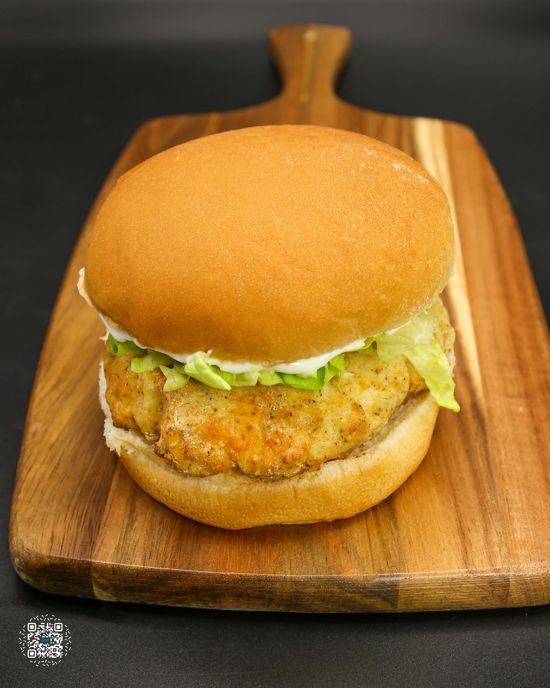
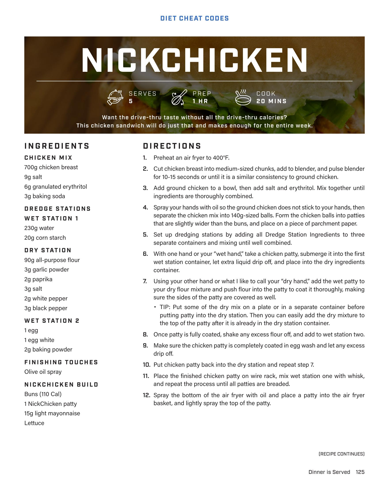
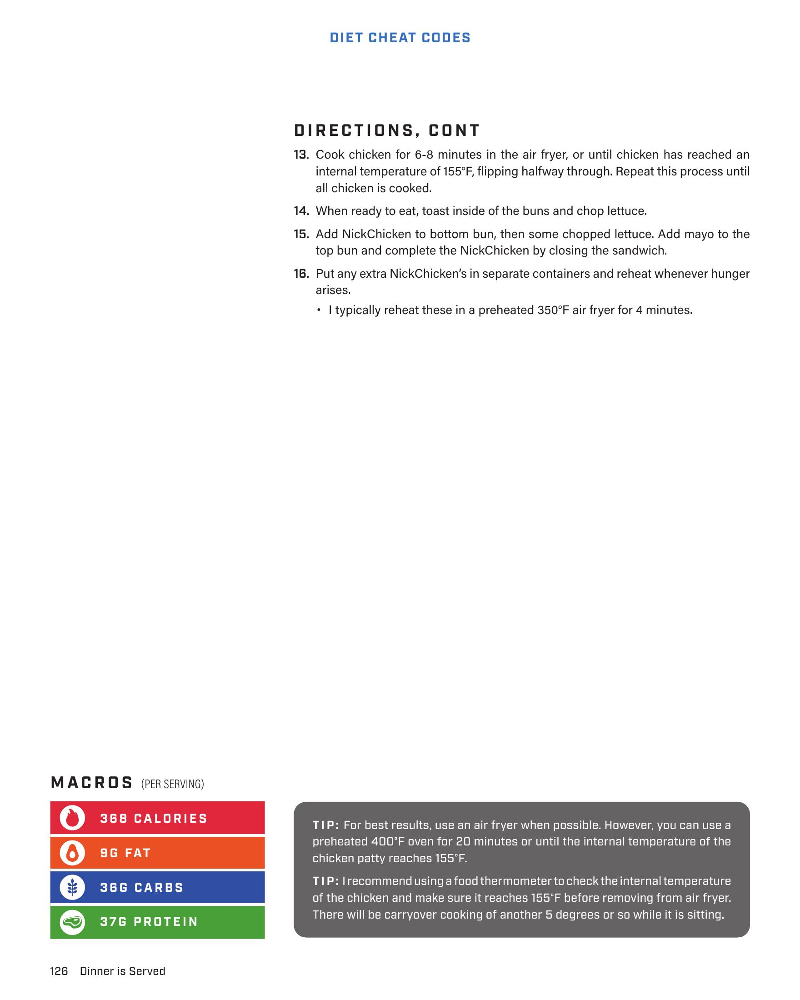

# NICKCHICKEN

**Serves:** 5 | **Prep:** 1 HR | **Cook:** 20 MINS

## Macros

| Calories | Fat | Carbs | Net Carbs | Protein |
|----------|-----|-------|-----------|---------|
| 388 | 9 | 38 | undefined | 37 |

## Ingredients

### CHICKEN MIX

- 700g chicken breast
- 9g salt
- 6g granulated erythritol
- 3g baking soda

### WET STATION 1

- 230g water
- 20g corn starch

### DRY STATION

- 90g all-purpose flour
- 3g garlic powder
- 2g paprika
- 3g salt
- 2g white pepper
- 3g black pepper

### WET STATION 2

- 1 egg
- 1 egg white
- 2g baking powder

### FINISHING TOUCHES

- Olive oil spray

### NICKCHICKEN BUILD

- Buns (110 Cal)
- 1 NickChicken patty
- 15g light mayonnaise
- Lettuce

## Directions

1. Preheat an air fryer to 400°F.
2. Cut chicken breast into medium-sized chunks, add to blender, and pulse blender for 10-15 seconds or until it is a similar consistency to ground chicken.
3. Add ground chicken to a bowl, then add salt and erythritol. Mix together until ingredients are thoroughly combined.
4. Spray your hands with oil so the ground chicken does not stick to your hands, then separate the chicken mix into 140g-sized balls. Form the chicken balls into patties that are slightly wider than the buns, and place on a piece of parchment paper.
5. Set up dredging stations by adding all Dredge Station Ingredients to three separate containers and mixing until well combined.
6. With one hand or your "wet hand," take a chicken patty, submerge it into the first wet station container; let extra liquid drip off, and place into the dry ingredients container.
7. Using your other hand or what I like to call your "dry hand," add the wet patty to your dry flour mixture and push flour into the patty to coat it thoroughly, making sure the sides of the patty are covered as well.
8. Once patty is fully coated, shake any excess flour off, and add to wet station two.
9. Make sure the chicken patty is completely coated in egg wash and let any excess drip off.
10. Put chicken patty back into the dry station and repeat step 7.
11. Place the finished chicken patty on wire rack, mix wet station one with whisk, and repeat the process until all patties are breaded.
12. Cook chicken for 6-8 minutes in the air fryer, or until chicken has reached an internal temperature of 165°F, flipping halfway through. Repeat this process until all chicken is cooked.
13. When ready to eat, toast inside of the buns and chop lettuce.
14. Add NickChicken to bottom bun, then some chopped lettuce. Add mayo to the top bun and complete the NickChicken by closing the sandwich.
15. Put any extra NickChicken's in separate containers and reheat whenever hunger arises.

## Tips

Put some of the dry mix on a plate or in a separate container before putting patty into the dry station. Then you can easily add the dry mixture to the top of the patty after it is already in the dry station container. For best results, use an air fryer when possible. However, you can use a preheated 400°F oven for 20 minutes or until the internal temperature of the chicken patty reaches 165°F. I recommend using a food thermometer to check the internal temperature of the chicken and make sure it reaches 165°F before removing from air fryer. There will be carryover cooking of another 5 degrees or so while it is sitting. I typically reheat these in a preheated 350°F air fryer for 4 minutes.

## Additional Recipe Pages

## Source Pages

125, 126, 127
