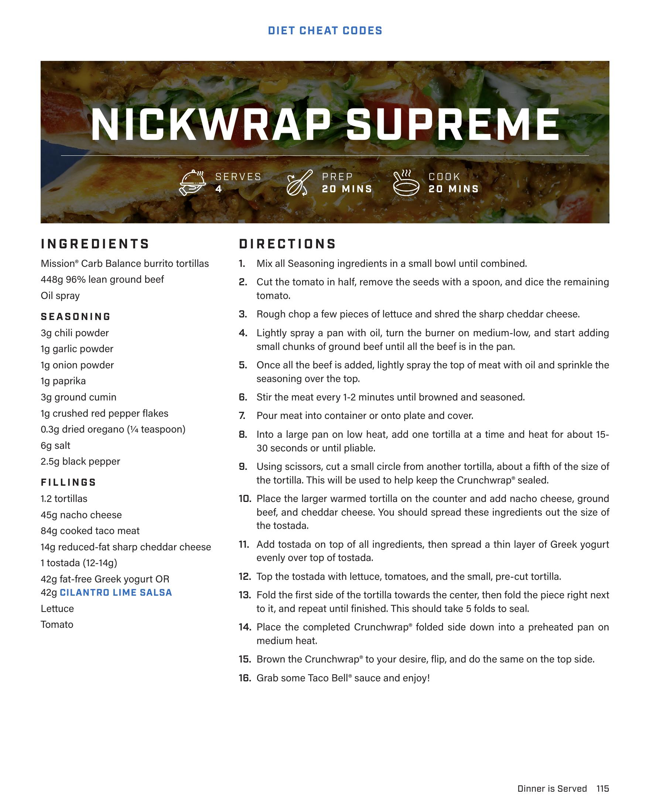

# NICKWRAP SUPREME

**Serves:** 4 | **Prep:** 20 MINS | **Cook:** 20 MINS

## Macros

| Calories | Fat | Carbs | Net Carbs | Protein |
|----------|-----|-------|-----------|---------|
| 0 | 0 | 0 | undefined | 0 |

## Ingredients

- Mission® Carb Balance burrito tortillas
- 448g 96% lean ground beef
- Oil spray

### SEASONING

- 3g chili powder
- 1g garlic powder
- 1g onion powder
- 1g paprika
- 3g ground cumin
- 1g crushed red pepper flakes
- 0.3g dried oregano (1/4 teaspoon)
- 6g salt
- 2.5g black pepper

### FILLINGS

- 1.2 tortillas
- 45g nacho cheese
- 84g cooked taco meat
- 14g reduced-fat sharp cheddar cheese
- 1 tostada (12-14g)
- 42g fat-free Greek yogurt OR
- 42g CILANTRO LIME SALSA
- Lettuce
- Tomato

## Directions

1. Mix all Seasoning ingredients in a small bowl until combined.
2. Cut the tomato in half, remove the seeds with a spoon, and dice the remaining tomato.
3. Rough chop a few pieces of lettuce and shred the sharp cheddar cheese.
4. Lightly spray a pan with oil, turn the burner on medium-low, and start adding small chunks of ground beef until all the beef is in the pan.
5. Once all the beef is added, lightly spray the top of meat with oil and sprinkle the seasoning over the top.
6. Stir the meat every 1-2 minutes until browned and seasoned.
7. Pour meat into container or onto plate and cover.
8. Into a large pan on low heat, add one tortilla at a time and heat for about 15-30 seconds or until pliable.
9. Using scissors, cut a small circle from another tortilla, about a fifth of the size of the tortilla. This will be used to help keep the Crunchwrap® sealed.
10. Place the larger warmed tortilla on the counter and add nacho cheese, ground beef, and cheddar cheese. You should spread these ingredients out the size of the tostada.
11. Add tostada on top of all ingredients, then spread a thin layer of Greek yogurt evenly over top of tostada.
12. Top the tostada with lettuce, tomatoes, and the small, pre-cut tortilla.
13. Fold the first side of the tortilla towards the center, then fold the piece right next to it, and repeat until finished. This should take 5 folds to seal.
14. Place the completed Crunchwrap® folded side down into a preheated pan on medium heat.
15. Brown the Crunchwrap® to your desire, flip, and do the same on the top side.
16. Grab some Taco Bell® sauce and enjoy!

## Source Pages

116
