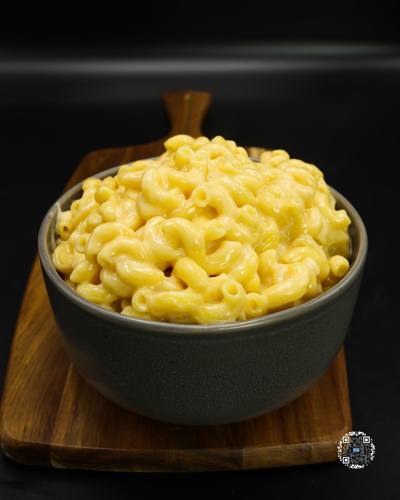

# OG MAC AND CHEESE

**Serves:** 2 | **Prep:** 5 MINS | **Cook:** 10 MINS

## Macros

| Calories | Fat | Carbs | Net Carbs | Protein |
|----------|-----|-------|-----------|---------|
| 656 | 9 | 103 | N/A | 44 |

## Ingredients

### PASTA MIXTURE

- 450g water
- 240g fat-free milk
- 4g salt
- 224g elbow macaroni

### MIX-INS

- 15g Parmigiano-Reggiano, grated
- 84g fat-free cheddar cheese, shredded
- 10g corn starch
- 105g sharp cheddar Velveeta® cheese

## Directions

1. Add Pasta Mixture to a pot, put on the stovetop, stir to combine, and turn on high heat.
2. Set a 10-minute timer for the pasta.
3. Add parmesan, fat-free cheese, and corn starch into a bowl and mix to combine.
4. Stir pasta more frequently as it comes to a boil to avoid burning the milk or having the noodles stick to the bottom of the pot.
5. After 10 minutes, take the pasta pot off the heat and immediately add Velveeta®. Stir for 1-2 minutes or until melted.
6. Add corn starch mixture and stir constantly for 2-3 minutes until everything is melted and mixed thoroughly.
7. Let pasta sit for 2 minutes to help thicken the cheese.
8. Give pasta a stir, pour into a bowl, and it is time to eat.

