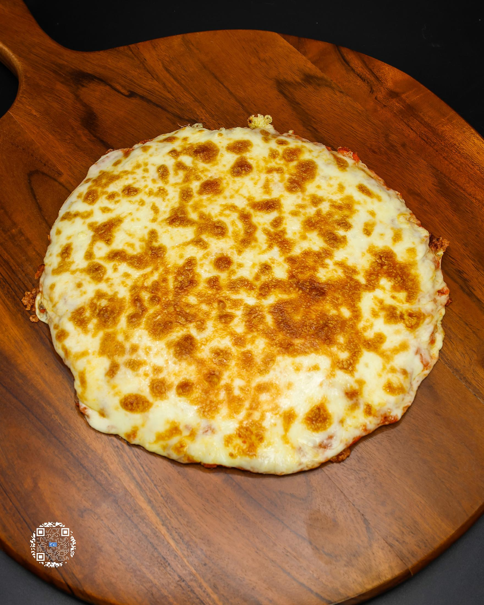
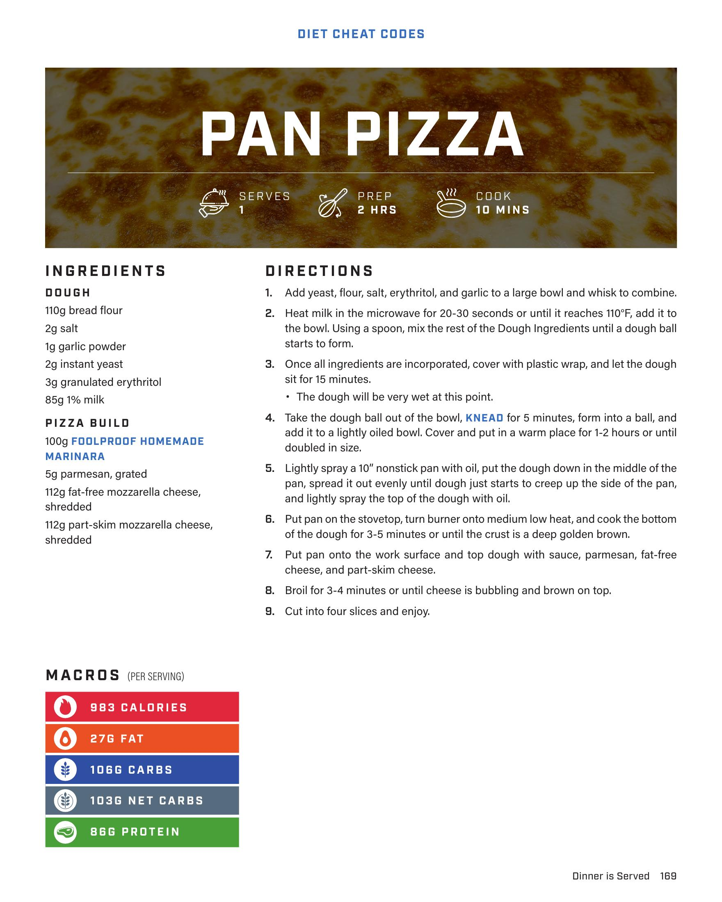
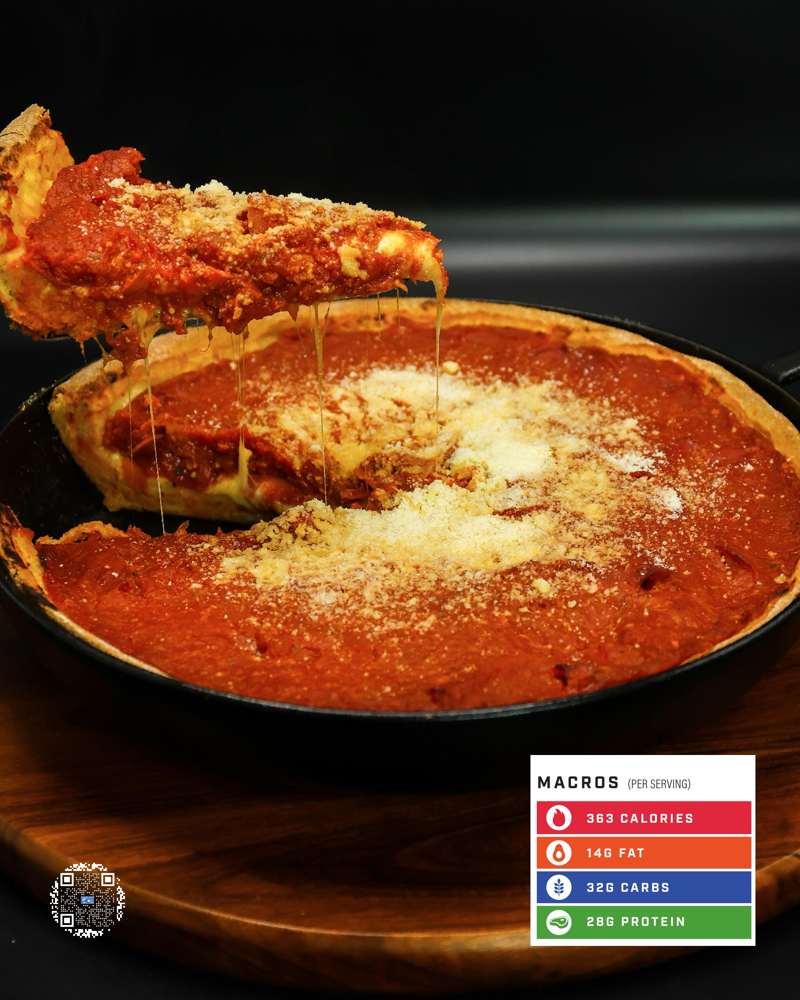

# PAN PIZZA

**Serves:** 1 | **Prep:** 2 HRS | **Cook:** 10 MINS

## Macros

| Calories | Fat | Carbs | Net Carbs | Protein |
|----------|-----|-------|-----------|---------|
| 983 | 27 | 106 | 103 | 88 |

## Ingredients

### DOUGH

- 110g bread flour
- 2g salt
- 1g garlic powder
- 2g instant yeast
- 3g granulated erythritol
- 85g 1% milk

### PIZZA BUILD

- 100g FOOLPROOF HOMEMADE MARINARA
- 5g parmesan, grated
- 112g fat-free mozzarella cheese, shredded
- 112g part-skim mozzarella cheese, shredded

## Directions

1. Add yeast, flour, salt, erythritol, and garlic to a large bowl and whisk to combine.
2. Heat milk in the microwave for 20-30 seconds or until it reaches 110°F, add it to the bowl. Using a spoon, mix the rest of the Dough Ingredients until a dough ball starts to form.
3. Once all ingredients are incorporated, cover with plastic wrap, and let the dough sit for 15 minutes.
4. Take the dough ball out of the bowl, KNEAD for 5 minutes, form into a ball, and add it to a lightly oiled bowl. Cover and put in a warm place for 1-2 hours or until doubled in size.
5. Lightly spray a 10" nonstick pan with oil, put the dough down in the middle of the pan, spread it out evenly until dough just starts to creep up the side of the pan, and lightly spray the top of the dough with oil.
6. Put pan on the stovetop, turn burner onto medium low heat, and cook the bottom of the dough for 3-5 minutes or until the crust is a deep golden brown.
7. Put pan onto the work surface and top dough with sauce, parmesan, fat-free cheese, and part-skim cheese.
8. Broil for 3-4 minutes or until cheese is bubbling and brown on top.
9. Cut into four slices and enjoy.

## Notes

The dough will be very wet at this point.

## Additional Recipe Pages

## Source Pages

169, 170, 171
