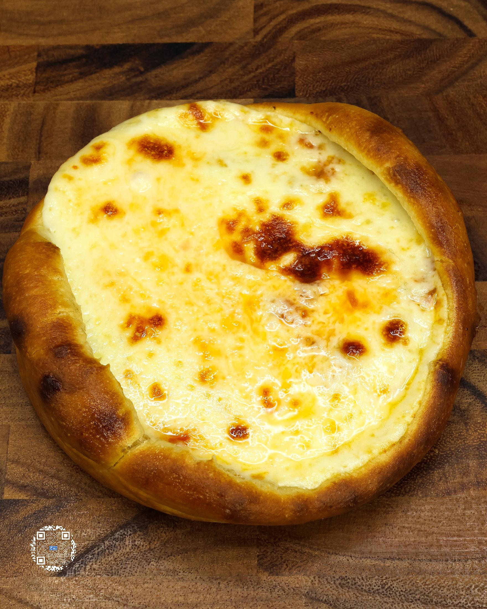
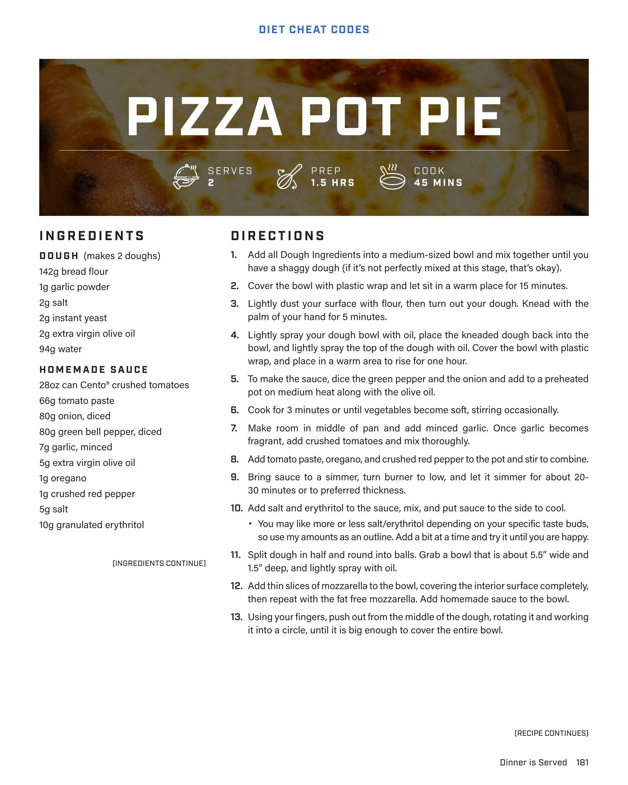
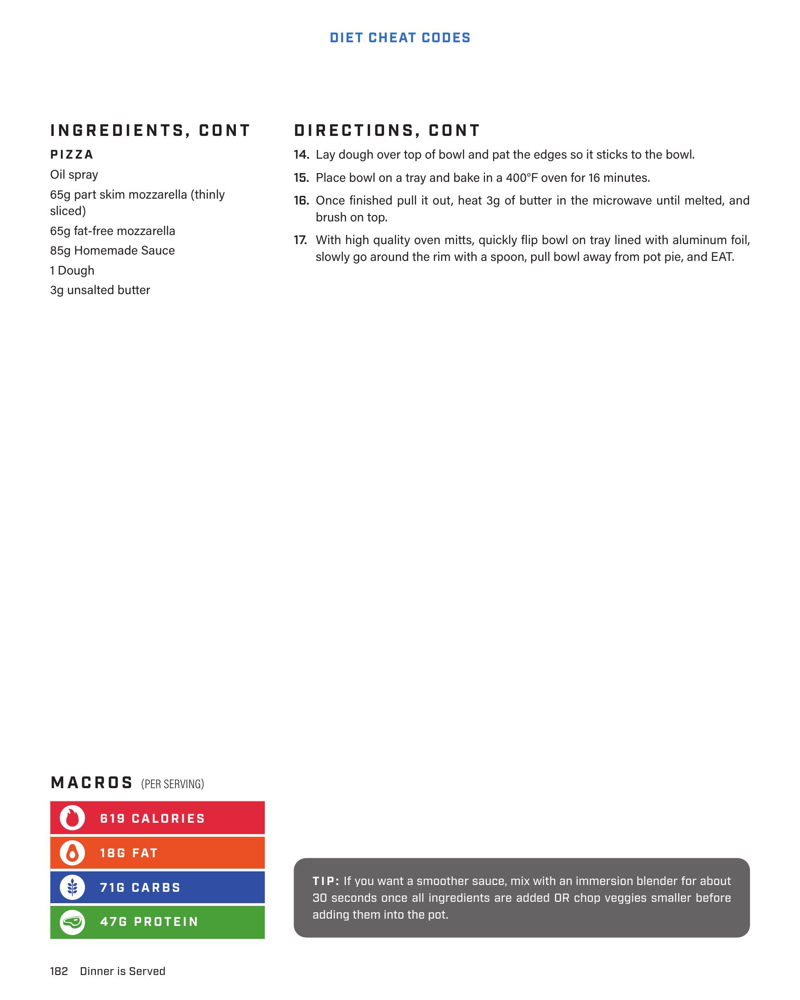

# PIZZA POT PIE

**Serves:** 2 | **Prep:** 1.5 HRS | **Cook:** 45 MINS

## Macros

| Calories | Fat | Carbs | Net Carbs | Protein |
|----------|-----|-------|-----------|---------|
| 619 | 18 | 71 | undefined | 47 |

## Ingredients

### DOUGH (makes 2 doughs)

- 142g bread flour
- 1g garlic powder
- 2g salt
- 2g instant yeast
- 2g extra virgin olive oil
- 94g water

### HOMEMADE SAUCE

- 28oz can Cento" crushed tomatoes
- 66g tomato paste
- 80g onion, diced
- 80g green bell pepper, diced
- 7g garlic, minced
- 5g extra virgin olive oil
- 1g oregano
- 1g crushed red pepper
- 5g salt
- 10g granulated erythritol

### PIZZA

- Oil spray
- 65g part skim mozzarella (thinly sliced)
- 65g fat-free mozzarella
- 85g Homemade Sauce
- 1 Dough
- 3g unsalted butter

## Directions

1. Add all Dough ingredients into a medium-sized bowl and mix together until you have a shaggy dough (if it's not perfectly mixed at this stage, that's okay).
2. Cover the bowl with plastic wrap and let sit in a warm place for 15 minutes.
3. Lightly dust your surface with flour, then turn out your dough. Knead with the palm of your hand for 5 minutes.
4. Lightly spray your dough bowl with oil, place the kneaded dough back into the bowl, and lightly spray the top of the dough with oil. Cover the bowl with plastic wrap, and place in a warm area to rise for one hour.
5. To make the sauce, dice the green pepper and the onion and add to a preheated pot on medium heat along with the olive oil.
6. Cook for 3 minutes or until vegetables become soft, stirring occasionally.
7. Make room in middle of pan and add minced garlic. Once garlic becomes fragrant, add crushed tomatoes and mix thoroughly.
8. Add tomato paste, oregano, and crushed red pepper to the pot and stir to combine.
9. Bring sauce to a simmer, turn burner to low, and let it simmer for about 20-30 minutes or to preferred thickness.
10. Add salt and erythritol to the sauce, mix, and put sauce to the side to cool.
11. Split dough in half and round into balls. Grab a bowl that is about 6.5" wide and 1.5" deep, and lightly spray with oil.
12. Add thin slices of mozzarella to the bowl, covering the interior surface completely, then repeat with the fat free mozzarella. Add homemade sauce to the bowl.
13. Using your fingers, push out from the middle of the dough, rotating it and working it into a circle, until it is big enough to cover the entire bowl.
14. Lay dough over top of bowl and pat the edges so it sticks to the bowl.
15. Place bowl on a tray and bake in a 400°F oven for 16 minutes.
16. Once finished pull it out, heat 3g of butter in the microwave until melted, and brush on top.
17. With high quality oven mitts, quickly flip bowl on tray lined with aluminum foil, slowly go around the rim with a spoon, pull bowl away from pot pie, and EAT.

## Tips

If you want a smoother sauce, mix with an immersion blender for about 30 seconds once all ingredients are added OR chop veggies smaller before adding them into the pot.

## Additional Recipe Pages

## Source Pages

181, 182, 183
