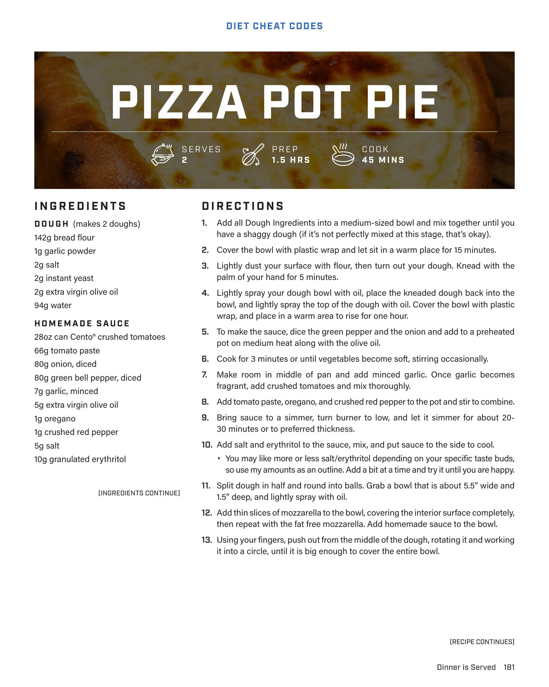

# PIZZA

**Serves:**  | **Prep:**  | **Cook:** 

## Macros

| Calories | Fat | Carbs | Net Carbs | Protein |
|----------|-----|-------|-----------|---------|
| 619 | 18 | 71 | N/A | 47 |

## Ingredients

- Oil spray
- 65g part skim mozzarella (thinly sliced)
- 65g fat-free mozzarella
- 85g Homemade Sauce
- 1 Dough
- 3g unsalted butter

## Directions

1. Lay dough over top of bowl and pat the edges so it sticks to the bowl.
2. Place bowl on a tray and bake in a 400°F oven for 16 minutes.
3. Once finished pull it out, heat 3g of butter in the microwave until melted, and brush on top.
4. With high quality oven mitts, quickly flip bowl on tray lined with aluminum foil, slowly go around the rim with a spoon, pull bowl away from pot pie, and EAT.

## Tips

If you want a smoother sauce, mix with an immersion blender for about 30 seconds once all ingredients are added OR chop veggies smaller before adding them into the pot.

