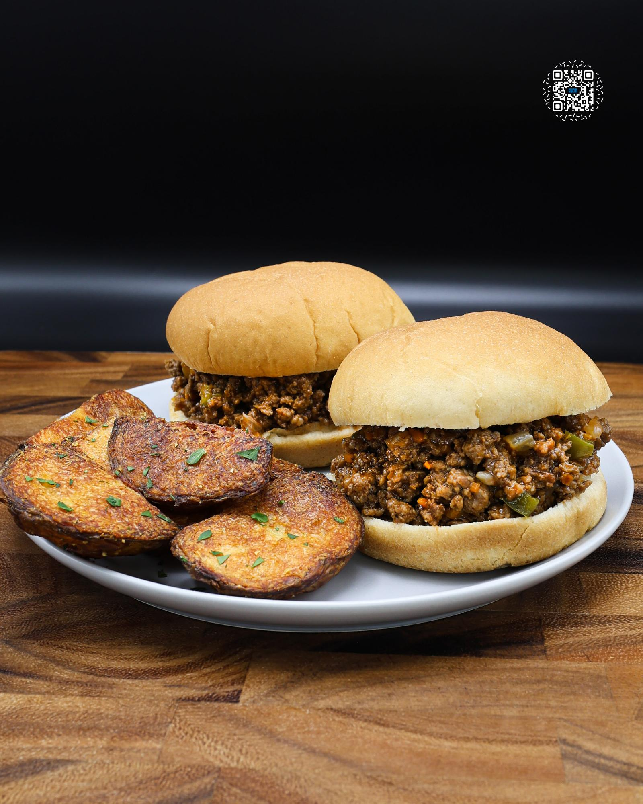

# SLOPPY JOES

**Serves:** 10 | **Prep:** 20 MINS | **Cook:** 30 MINS

## Macros

| Calories | Fat | Carbs | Net Carbs | Protein |
|----------|-----|-------|-----------|---------|
| 211 | 7 | 26 | 8 | 26 |

## Ingredients

- 10g olive oil (veggies)
- 125g onion, diced
- 125g green bell pepper, diced
- 125g carrots, diced
- 15g garlic, minced
- 2lb 96% lean ground beef
- 3g baking soda
- 10g olive oil (meat)
- 8g salt (or to taste)
- 5g onion powder
- 2g black pepper
- 256g G. Hughes00ae sugar-free ketchup
- 10g mustard
- 30g Worcestershire sauce
- 30g brown sugar erythritol
- 8g cornstarch
- 30g water
- Keto Culture00ae buns (50 Cal)

## Directions

1. Add ground beef and baking soda to a large bowl and mix until well combined.
2. Dice peppers, jalapenos, peeled carrots, and onion. Mince garlic.
3. Heat olive oil in a saucepan over medium-high heat, then add chopped veggies. Cook until they are soft or begin to take on some color.
4. Create a small hole in the center of the pan, add minced garlic, and stir until garlic becomes fragrant. Transfer sautéed vegetables to a medium bowl.
5. Return the pan to the stovetop over medium-high heat. Allow pan to heat up for 2-3 minutes and add oil.
6. Add meat to the pan and press it down firmly to ensure maximum contact with the hot surface. Allow to brown for 2-3 minutes and flip.
7. Break the meat into small, bite-sized pieces using a meat chopper or potato masher.
8. Add vegetables back to the pan, along with salt, black pepper, and onion powder. Mix to combine.
9. While the meat is cooking, combine ketchup, mustard, Worcestershire sauce, and brown sugar in a separate bowl.
10. When the meat is fully cooked and no longer pink, pour the sauce into the pan.
11. Mix the sauce and meat in the pan and cook for 1-2 minutes.
12. In a small bowl, combine cornstarch and water, stirring until the cornstarch is fully dissolved.
13. Add cornstarch slurry to the pan, stirring immediately. Reduce the heat to low.
14. Allow the mixture to cook for 3-5 minutes, stirring occasionally.
15. Once sauce has thickened, divide the meat into 10 equal portions. Place each portion, approximately 130-140g, onto a bun and enjoy!

## Tips

Taste meat before serving and add salt if necessary.

