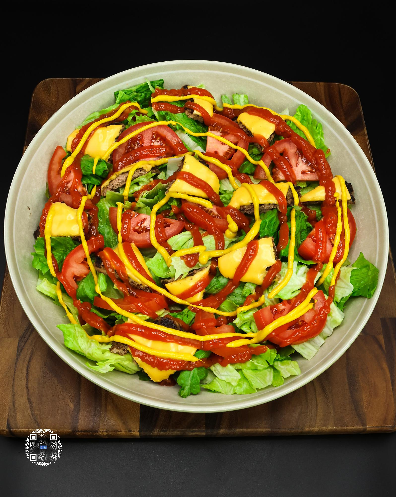

# SMASHBURGER SALAD

**Serves:** 1 | **Prep:** 10 MINS | **Cook:** 10 MINS

## Macros

| Calories | Fat | Carbs | Net Carbs | Protein |
|----------|-----|-------|-----------|---------|
| 533 | 20 | 27 | N/A | 59 |

## Ingredients

- 210g 96% lean ground beef
- 7.5g unsalted butter
- 3 slices original Velveeta® cheese
- 250g iceberg lettuce, chopped
- 140g tomato, sliced
- 64g no sugar added ketchup
- 20g mustard
- Salt and pepper, to taste

## Directions

1. Separate the ground beef into three 70g balls.
2. Place each ball between 2 pieces of 10"x10" parchment paper and flatten using a cast iron pan or another flat, heavy object.
3. Prep vegetables and add them to a large bowl.
4. Add 2.5g of butter to a preheated pan on medium high heat and swirl it around the pan.
5. Add one patty to the pan, press the patty into the pan for 2 seconds using a spatula, add salt and pepper, and let first side cook for 1 minute or until juices have risen to the top of the patty.
6. Scrape the burger off the pan while trying to keep the charred bits attached to the burger. Flip it, add cheese to the top of the patty, and cook for an additional minute.
7. Place the finished patty on a cutting board, repeat steps 3-5 for the other patties, and chop the cheeseburgers into bite sized chunks.
8. Add chopped burgers over the top of the vegetables, top with ketchup and mustard, and it is time to dig in.

