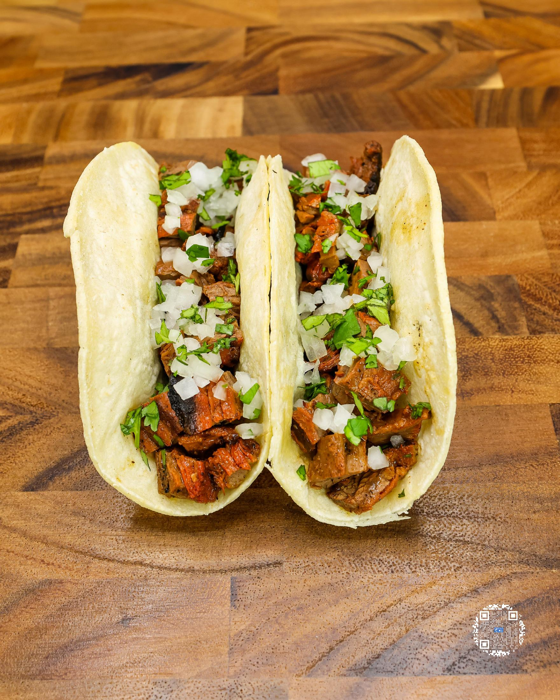
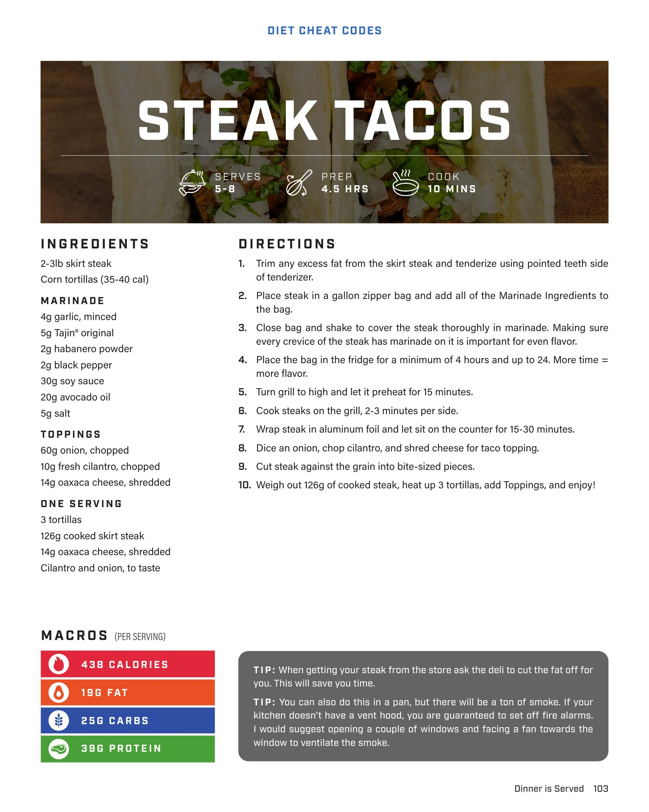

# STEAK TACOS

**Serves:** 5-8 | **Prep:** 4.5 HRS | **Cook:** 10 MINS

## Macros

| Calories | Fat | Carbs | Net Carbs | Protein |
|----------|-----|-------|-----------|---------|
| 438 | 19 | 25 | N/A | 39 |

## Ingredients

- 2-3lb skirt steak
- Corn tortillas (35-40 cal)

### MARINADE

- 4g garlic, minced
- 5g Tajin original
- 2g habanero powder
- 2g black pepper
- 30g soy sauce
- 20g avocado oil
- 5g salt

### TOPPINGS

- 60g onion, chopped
- 10g fresh cilantro, chopped
- 14g oaxacacheese, shredded

### ONE SERVING

- 3 tortillas
- 126g cooked skirt steak
- 14g oaxacacheese, shredded
- Cilantro and onion, to taste

## Directions

1. Trim any excess fat from the skirt steak and tenderize using pointed teeth side of tenderizer.
2. Place steak in a gallon zipper bag and add all of the Marinade Ingredients to the bag.
3. Close bag and shake to cover the steak thoroughly in marinade. Making sure every crevice of the steak has marinade on it is important for even flavor.
4. Place the bag in the fridge for a minimum of 4 hours and up to 24. More time = more flavor.
5. Turn grill to high and let it preheat for 15 minutes.
6. Cook steaks on the grill, 2-3 minutes per side.
7. Wrap steak in aluminum foil and let sit on the counter for 15-30 minutes.
8. Dice an onion, chop cilantro, and shred cheese for taco topping.
9. Cut steak against the grain into bite-sized pieces.
10. Weigh out 126g of cooked steak, heat up 3 tortillas, add Toppings, and enjoy!

## Tips

When getting your steak from the store ask the deli to cut the fat off for you. This will save you time.You can also do this in a pan, but there will be a ton of smoke. If your kitchen doesn't have a vent hood, you are guaranteed to set off fire alarms. I would suggest opening a couple of windows and facing a fan towards the window to ventilate the smoke.

## Additional Recipe Pages

## Source Pages

103, 104
