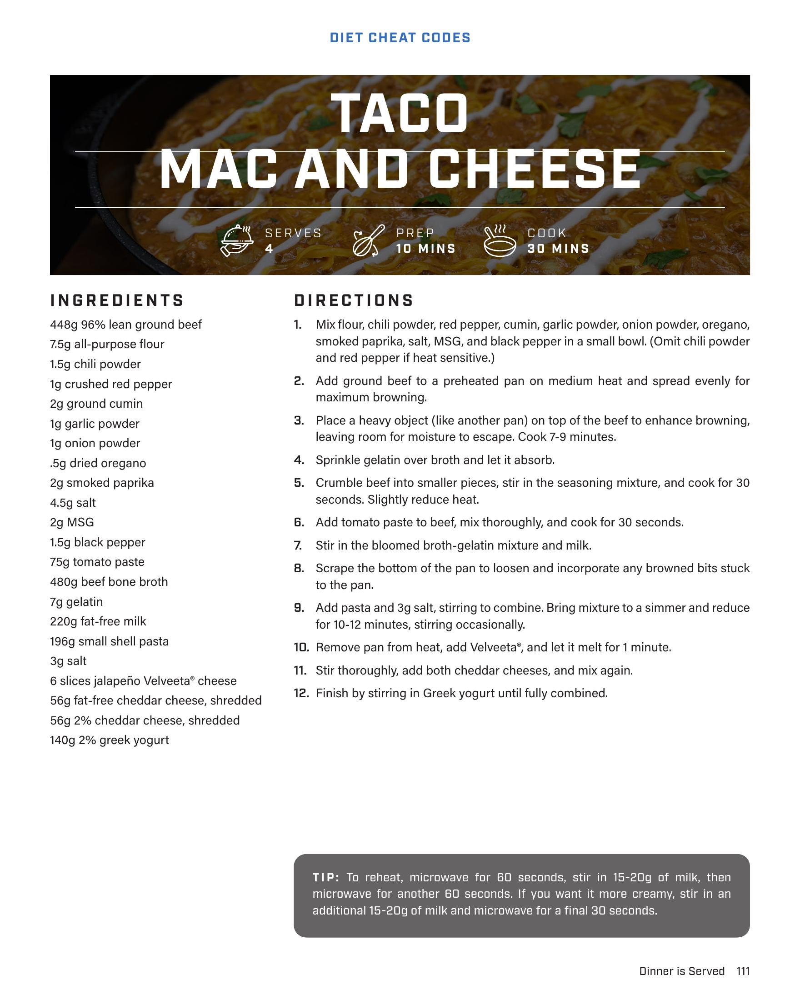

# TACO MAC AND CHEESE

**Serves:** 4 | **Prep:** 10 MINS | **Cook:** 30 MINS

## Macros

| Calories | Fat | Carbs | Net Carbs | Protein |
|----------|-----|-------|-----------|---------|
| 0 | N/A | N/A | N/A | N/A |

## Ingredients

- 448g 96% lean ground beef
- 7.5g all-purpose flour
- 1.5g chili powder
- 1g crushed red pepper
- 2g ground cumin
- 1g garlic powder
- 1g onion powder
- .5g dried oregano
- 2g smoked paprika
- 4.5g salt
- 2g MSG
- 1.5g black pepper
- 75g tomato paste
- 480g beef bone broth
- 7g gelatin
- 220g fat-free milk
- 196g small shell pasta
- 3g salt
- 6 slices jalapeño Velveeta® cheese
- 56g fat-free cheddar cheese, shredded
- 56g 2% cheddar cheese, shredded
- 140g 2% greek yogurt

## Directions

1. Mix flour, chili powder, red pepper, cumin, garlic powder, onion powder, oregano, smoked paprika, salt, MSG, and black pepper in a small bowl. (Omit chili powder and red pepper if heat sensitive.)
2. Add ground beef to a preheated pan on medium heat and spread evenly for maximum browning.
3. Place a heavy object (like another pan) on top of the beef to enhance browning, leaving room for moisture to escape. Cook 7-9 minutes.
4. Sprinkle gelatin over broth and let it absorb.
5. Crumble beef into smaller pieces, stir in the seasoning mixture, and cook for 30 seconds. Slightly reduce heat.
6. Add tomato paste to beef, mix thoroughly, and cook for 30 seconds.
7. Stir in the bloomed broth-gelatin mixture and milk.
8. Scrape the bottom of the pan to loosen and incorporate any browned bits stuck to the pan.
9. Add pasta and 3g salt, stirring to combine. Bring mixture to a simmer and reduce for 10-12 minutes, stirring occasionally.
10. Remove pan from heat, add Velveeta®, and let it melt for 1 minute.
11. Stir thoroughly, add both cheddar cheeses, and mix again.
12. Finish by stirring in Greek yogurt until fully combined.

## Tips

To reheat, microwave for 60 seconds, stir in 15-20g of milk, then microwave for another 60 seconds. If you want it more creamy, stir in an additional 15-20g of milk and microwave for a final 30 seconds.

## Source Pages

112
