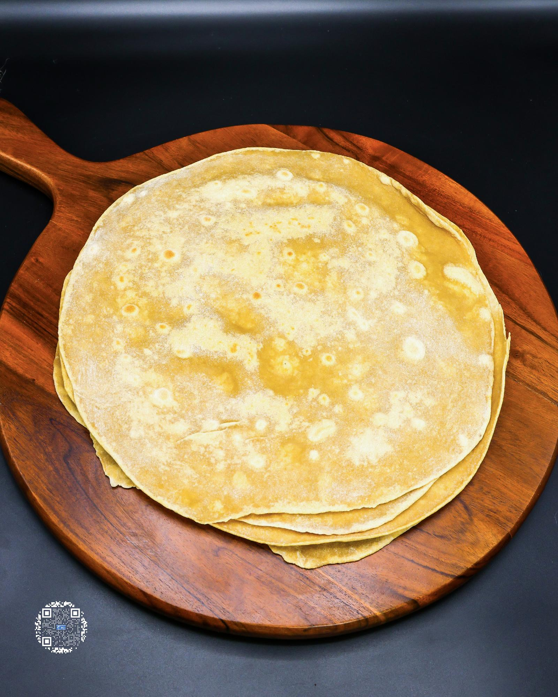

# BURRITO TORTILLAS

**Serves:** 2 | **Prep:** 60 MINS | **Cook:** 3 MINS

## Macros

| Calories | Fat | Carbs | Net Carbs | Protein |
|----------|-----|-------|-----------|---------|
| 177 | 4 | 37 | 22 | 14 |

## Ingredients

### DRY

- 42g all-purpose flour
- 30g vital wheat gluten
- 30g oat fiber
- 2g baking powder
- 2g salt
- 2g xanthan gum

### WET

- 6g avocado oil
- 85g water

## Directions

1. Add Dry Ingredients into a medium-sized bowl and whisk to combine.
2. In a separate bowl, mix the Wet Ingredients together, add to the Dry Ingredients, and mix with a spoon until most of the ingredients come together.
3. Dump the contents of the bowl onto the counter and use hands to incorporate until there are no more dry parts left in the dough.
4. Finish kneading this dough by squeezing dough for 30-60 seconds, switching hands with each squeeze.
5. Divide dough in half, form into balls, cover with a damp towel or wrap each ball individually with plastic wrap, and rest dough for 30 minutes.
6. Dust counter with flour, plop a dough ball down, dust top of the dough with flour, and roll out using a rolling pin. If dough starts sticking to the rolling pin, add more flour where it is sticking, spread, and continue. I like to roll the dough 4-5 times then turn it 90 degrees, roll 4-5 times again, and repeat.
7. Once rolled out to 11-12", place underneath a damp tea towel or kitchen towel to prevent the tortilla from drying out.
8. Repeat with the second tortilla and place on a preheated cast iron or griddle on medium-high heat.
9. Cook each side for 30-60 seconds, flip, and cook another 30-60 seconds.
10. Put under a separate wet tea towel or kitchen towel until cool.
11. Use right away or fold and place in a plastic bag for up to 3-4 days.

## Tips

If storing for later use, put tortilla in the microwave for 10 seconds when ready to eat. If making a large batch and need to avoid molding, fold twice, place in a gallon bag, and throw into the freezer. When ready to use cover with a damp tea towel or paper towel and reheat for 30 seconds.

## Notes

I include an extra 8g into the macros of all-purpose flour that is used to roll the tortilla out, even though it is not included in the ingredient list itself.

