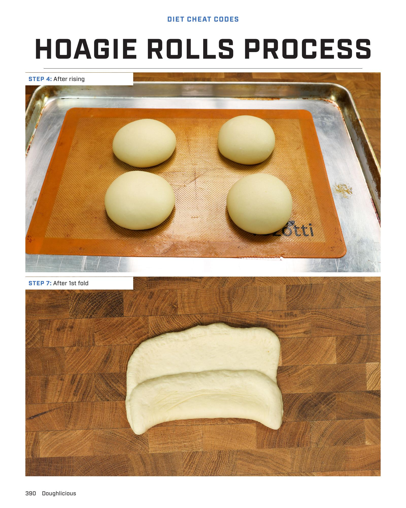

# Doughlicious Ciabatta

**Serves:** 4 | **Prep:** 20 MINS | **Cook:** 20 MINS

## Macros

| Calories | Fat | Carbs | Net Carbs | Protein |
|----------|-----|-------|-----------|---------|
| 250 | 2 | 45 | 43 | 8 |

## Ingredients

### WET

- 200g warm water (105-115°F)
- 1 tbsp olive oil

### DRY

- 1 tsp active dry yeast
- 1 tsp sugar
- 250g all-purpose flour
- 1 tsp salt

- Cornmeal for dusting

## Directions

1. In a large bowl, combine warm water and olive oil. Stir in yeast and sugar. Let sit for 5 minutes until foamy.
2. Add flour and salt to the wet mixture. Stir with a wooden spoon until a shaggy dough forms.
3. Turn the dough out onto a lightly floured surface and knead for 5-7 minutes until smooth and elastic.
4. Lightly oil a clean bowl, place the dough in it, and turn to coat. Cover with plastic wrap and let rise in a warm place for 1-1.5 hours, or until doubled in size.
5. Gently deflate the dough and divide it into 4 equal pieces.
6. Shape each piece into a rectangle, about 6-8 inches long.
7. Fold one long side of the rectangle over to meet the other long side, sealing the seam by pinching along the edge.
8. Roll the sealed dough gently to create a more even ciabatta shape.
9. Dust a baking sheet with cornmeal. Place the shaped ciabatta loaves on the baking sheet, seam side down.
10. Cover with a clean kitchen towel and let rise for another 30-45 minutes, or until noticeably puffy.
11. Preheat oven to 400°F (200°C).
12. Bake for 15-20 minutes, or until golden brown and hollow-sounding when tapped on the bottom.

## Tips

For a crispier crust, place a shallow pan of water on the bottom rack of your oven while preheating.

