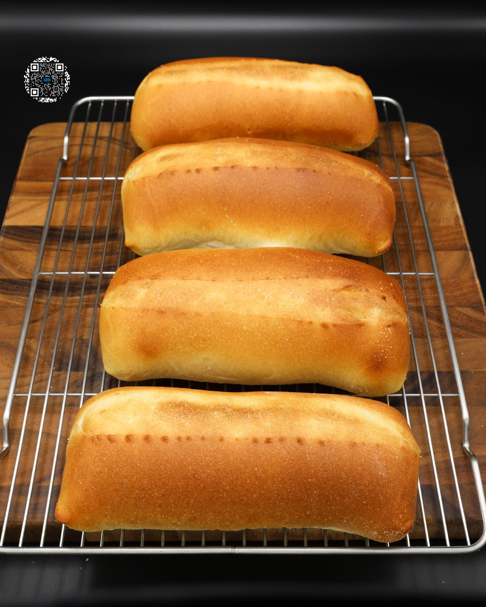

# HOAGIE ROLLS

**Serves:** 4 | **Prep:** 3.5 HRS | **Cook:** 13 MINS

## Macros

| Calories | Fat | Carbs | Net Carbs | Protein |
|----------|-----|-------|-----------|---------|
| 308 | 3 | 50 | N/A | 20 |

## Ingredients

### DRY

- 240g King Arthur® bread flour
- 60g vital wheat gluten
- 8g dough conditioner
- 6g diastatic malt powder
- 2.5g instant yeast
- 5g salt

### WET

- 10g Crisco®
- 192g water
- Corn meal
- 56g water (oven)

## Directions

1. Add all dry ingredients to a food processor and mix for 60 seconds.
2. Add Crisco® to the food processor and start blending for 10 seconds. As the processor is blending, add water over a 20 second period and continue mixing for 30 seconds.
3. Plop the dough on the counter, knead for 6-8 minutes, and divide into 4 equal sized pieces of dough. Each dough should weigh about 129g.
4. Roll each piece of dough into a ball, making sure the bottom of the ball is sealed. Line a baking pan with a nonstick liner, space dough balls evenly apart, and cover for 90 minutes.
5. Flip one piece of dough bottom side up and gently roll the dough back and forth with a rolling pin. Continue rolling until about a quarter inch thick.
6. Pick up the dough and place onto the counter in the shape of a square. Roll out the edges to get an even thickness.
7. The dough should be about 6" wide and 6.5" long.
8. Take the top of the dough and fold about half of it onto itself. Using the tips of your fingers, press the edge of the dough into the crease.
9. Take the bottom of the dough and fold it up. It should perfectly line up to the top corners of the dough. Seal the roll by pinching along the edge and sides of the dough. The roll should be about 6" long.
10. Dust a nonstick liner with corn meal and place the hoagie roll directly on the corn meal.
11. Repeat for the other pieces of dough and cover for 90 minutes.
12. Add a steel brownie pan to the bottom rack of the oven and preheat the oven to 425°F.
13. Add a piece of parchment paper to a pizza peel or a cookie sheet.
14. Grab each piece of dough from the bottom, lightly stretch it out from the middle for a couple seconds, and place them on the pizza peel, making sure to evenly space them out. The roll should be about 8" long.
15. Make a cut down the middle of each roll with a sharp knife or bread lame.
16. Heat up 56g water in a microwave for 30-40 seconds or until boiling.
17. Using oven mitts, add the hoagies to a baking steel, pour the water into the brownie pan, and quickly shut the oven door.
18. Bake for 12-14 minutes and immediately transfer to a wire rack to cool.

## Tips

If you don't have a baking steel, you can cook these on a sheet pan with a nonstick liner. There is only 1 difference. About 3-4 minutes before the rolls are finished baking, you will have to flip them to ensure the bottom of the hoagie browns correctly.

