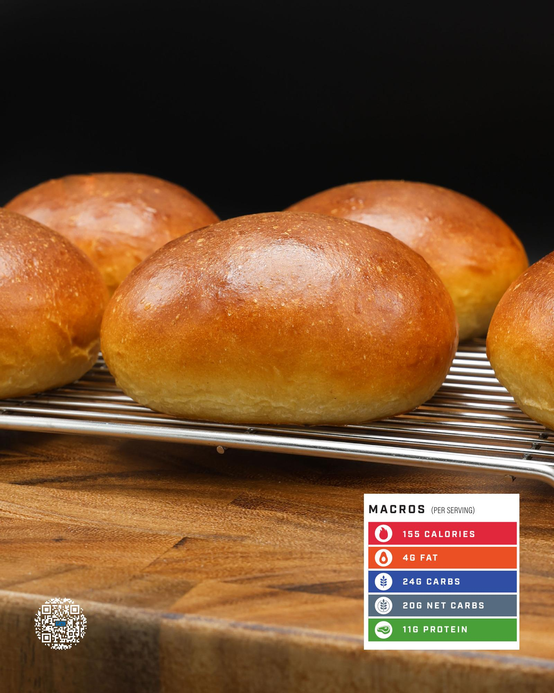

# POTATO BUNS

**Serves:** 6 | **Prep:** 3 HRS | **Cook:** 18 MINS

## Macros

| Calories | Fat | Carbs | Net Carbs | Protein |
|----------|-----|-------|-----------|---------|
| 155 | 4 | 24 | 20 | 11 |

## Ingredients

### MASHED POTATO

- 70g water
- 17g dried mashed potato

### DRY

- 135g 00 flour
- 55g vital wheat gluten
- 6g dough conditioner
- 5g diastatic malt powder
- 24g granulated erythritol
- 5g instant yeast
- 3g salt

### WET

- 40g fat-free milk
- 14g unsalted butter, melted
- Potato
- 1 egg

### EGG WASH

- 1 egg
- 15g water

## Directions

1. Add 70 grams of water into a medium size bowl and microwave for 60 seconds.
2. Using kitchen gloves, grab the bowl out of the microwave, add dried potato, and mix to combine.
3. Add Dry ingredients into the food processor and process for 60 seconds.
4. Add milk and butter to a glass measuring cup and microwave for 20-30 seconds. Mix until the butter is melted. The temperature should not exceed 120°F.
5. Add potato and egg into the food processor, process on high, and pour in milk mixture over a 15 second period. Continue to process for an additional 30 seconds.
6. Place dough on your work surface, KNEAD the dough for 8-10 minutes or until smooth, and round into a taut ball.
7. Lightly spray a large bowl with oil, place dough ball into the center of the bowl, lightly spray the top of the ball with oil, and cover for 1.5-2 hours.
8. Divide dough into 6 equal portions, about 87 grams each. Roll each piece of dough into a ball, making sure the bottom of the ball is sealed.
9. Line a baking pan with a nonstick liner and space dough balls evenly apart.
10. With the bottom of your palm, flatten each dough ball so that after rising and baking they will look like a bun. Pop any noticeable air pockets with fingers or a toothpick.
11. Cover buns with another baking pan or damp tea towel and put in a warm place to rise for 60-90 minutes.
12. In a small bowl, add Egg Wash ingredients, whisk to combine, and brush a thin layer of egg wash on the top and sides of each bun.
13. Bake the buns in a preheated 375°F oven for 16-18 minutes, turning the pan halfway through. Place buns on a cooling rack when finished.

## Tips

If not using within 3-4 days, throw the cooked buns in the freezer and reheat them in a preheated 350°F oven for 10-12 minutes.

## Notes

You may use bread flour instead of 00 flour, but the final product won't be as soft and pillowy.

