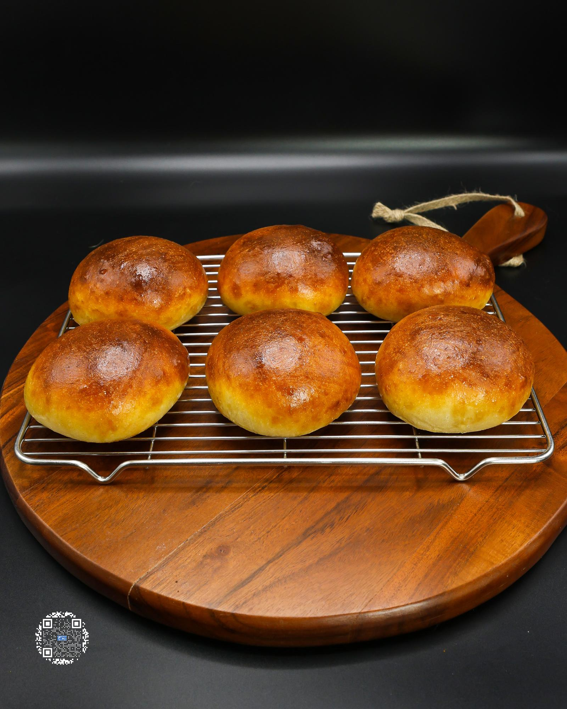

# PROTEIN BUNS

**Serves:** 6 | **Prep:** 2 HRS | **Cook:** 20 MINS

## Macros

| Calories | Fat | Carbs | Net Carbs | Protein |
|----------|-----|-------|-----------|---------|
| 158 | 1 | 28 | 25 | 10 |

## Ingredients

### TANGZHONG

- 30g fat-free milk
- 15g water
- 15g all-purpose flour

### DOUGH

### DRY

- 165 all-purpose flour
- 45g vital wheat gluten
- 5g diastatic malt powder
- 18g granulated erythritol
- 3g instant yeast
- 4g salt

### WET

- 130g fat-free milk
- Tangzhong
- 7g unsalted butter

## Directions

1. Add Tangzhong ingredients into a small pan, whisk until combined, then put on medium low heat. Keep stirring with whisk until it begins to thicken and clump.
2. Switch to a rubber spatula and keep mixing until there is no more liquid left, or it looks similar to mashed potatoes.
3. Place Tangzhong in a small bowl to cool. In a separate glass, heat up milk for the dough until it reaches 110°F (about 20-30 seconds in the microwave).
4. Add Dry Ingredients into the food processor and process for 15 seconds.
5. Add Tangzhong and butter into the food processor, process on high, then pour in milk over a 15 second period, and continue to process for an additional 30 seconds.
6. The dough should have formed into a ball. Plop dough on the counter and KNEAD dough for 3-5 minutes.
7. Lightly spray a large bowl with oil, place dough ball into the center of the bowl, lightly spray the top of the ball with oil, and cover for an hour.
8. Press any big air pockets out of the dough and divide into 6 equal portions.
9. Roll each piece of dough into a ball, making sure the bottom of the ball is sealed. Line a baking pan with a nonstick liner, and space dough balls evenly apart.
10. With the bottom of your palm, flatten each dough ball so that after rising and baking they will look like a bun. Pop any noticeable air pockets with fingers or a toothpick.
11. Cover buns with another baking pan or damp kitchen towel and let rise for 45 minutes. Place a small cast iron pan on a lower rack in the oven before preheating.
12. In a small bowl whisk an egg and brush a thin layer of egg wash to the top of each bun. Optional: Add sesame seeds over the top.
13. Bake the buns in a preheated 400°F oven, add 4-5 cubes of ice into the cast iron, and shut the oven door right away.
14. Bake for 17 minutes, flipping the pan halfway through. Place buns on a cooling rack when finished.

## Tips

If not using within 3-4 days, throw the cooked buns in the freezer and reheat them in a preheated 350°F oven for 10-12 minutes.

