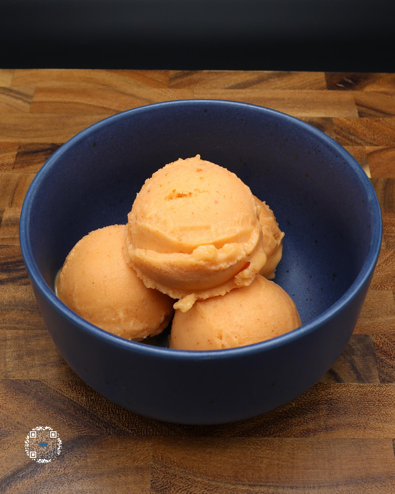

# PEACH SORBET

**Serves:** 1 | **Prep:** 5 MINS | **Cook:** 5 MINS

## Macros

| Calories | Fat | Carbs | Net Carbs | Protein |
|----------|-----|-------|-----------|---------|
| 117 | 1 | 59 | 29 | 3 |

## Ingredients

- 300g peaches
- 140g water
- 30g granulated erythritol
- .5g salt

## Directions

1. Rinse peaches under water, cut around the pit, twist the two halves, and remove the pit.
2. Add all ingredients to a high sided container.
3. Using an immersion blender, mix the ingredients for 90 seconds and add to a pint.
4. Put the top on the pint and freeze for 24 hours.
5. Take the pint out of the freezer, run it under warm water for 60 seconds, dry the pint off, and load it into the CREAMi®.
6. Run pint on the sorbet function and re-spin the pint 1-2 more times for desired consistency.
7. Eat.

