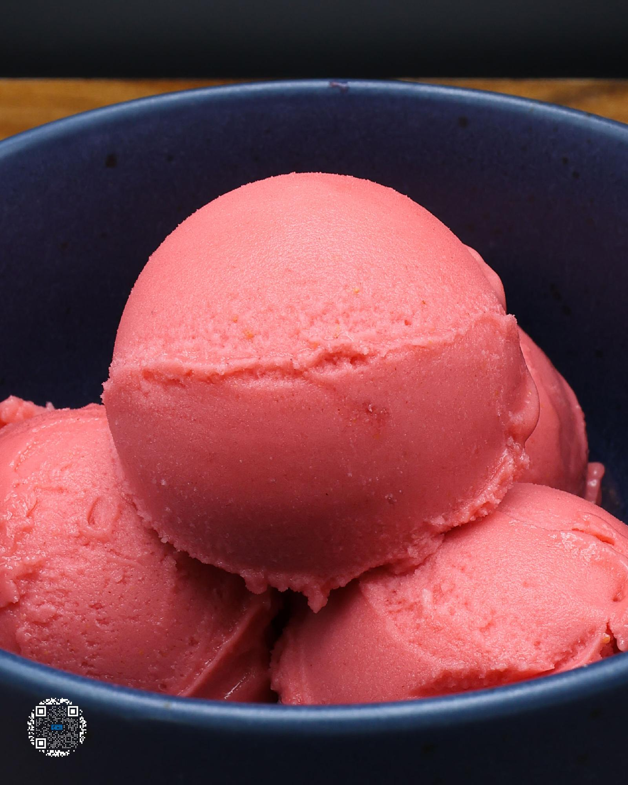

# RASPBERRY SORBET

**Serves:** 1 | **Prep:** 10 MINS | **Cook:** 5 MINS

## Macros

| Calories | Fat | Carbs | Net Carbs | Protein |
|----------|-----|-------|-----------|---------|
| 120 | 2 | 67 | 27 | 3 |

## Ingredients

- 230g raspberries
- 210g water
- 40g granulated erythritol
- .5g salt

## Directions

1. Rinse raspberries and add them to a high sided container along with all other ingredients.
2. Using an immersion blender, mix the ingredients for 90 seconds.
3. Strain the mixture over the pint and add seeds as desired.
4. Put the top on the pint and freeze for 24 hours.
5. Take the pint out of the freezer, run it under warm water for 60 seconds, dry the pint off, and load it into the CREAMi®.
6. Run pint on the sorbet function and re-spin the pint 1-2 more times for desired consistency.
7. Eat.

## Tips

Personally, I like either not adding any seeds at all or using ½ the seeds.

