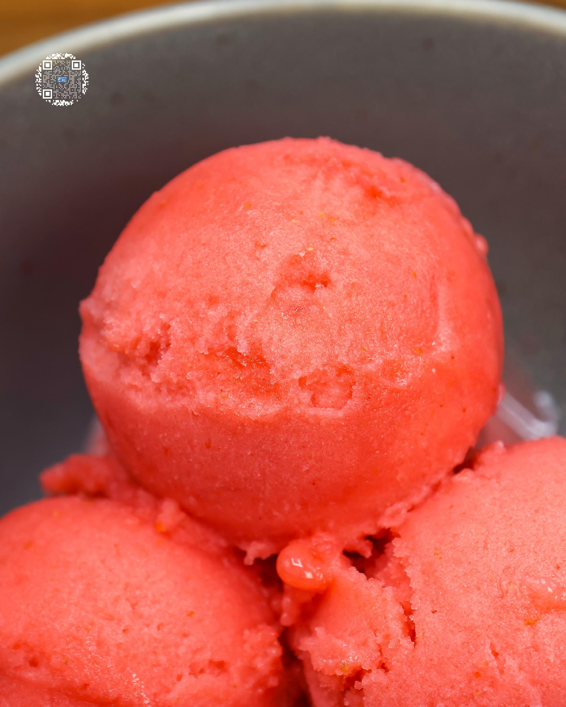

# STRAWBERRY SORBET

**Serves:** 1 | **Prep:** 10 MINS | **Cook:** 5 MINS

## Macros

| Calories | Fat | Carbs | Net Carbs | Protein |
|----------|-----|-------|-----------|---------|
| 96 | 0 | 44 | 24 | 3 |

## Ingredients

- 1lb strawberries

### PINT INGREDIENTS

- 300g strawberries
- 130g water
- 20g granulated erythritol
- 0.5g salt

## Directions

1. Rinse strawberries under water and cut off the stems.
2. Add Pint Ingredients into the pint and using an immersion blender crush strawberries and mix for 60-90 seconds or until everything is smooth.
3. Put the top on the pint and freeze for 24 hours.
4. Take the pint out of the freezer, run it under warm water for 60 seconds, dry the pint off, and load it into the CREAMi®.
5. Run pint on the sorbet function and directly after on the re-spin function.
6. A perfect sorbet consistency has now been achieved and it is time to eat.

## Tips

If you don't have an immersion blender, you can use a food processor or regular blender to break down the strawberries. If you want a more ice cream-like consistency, unload the pint after the re-spin and using a spoon, push the contents of the CREAMi® down, smooth and level the surface, and re-spin for a second time.

