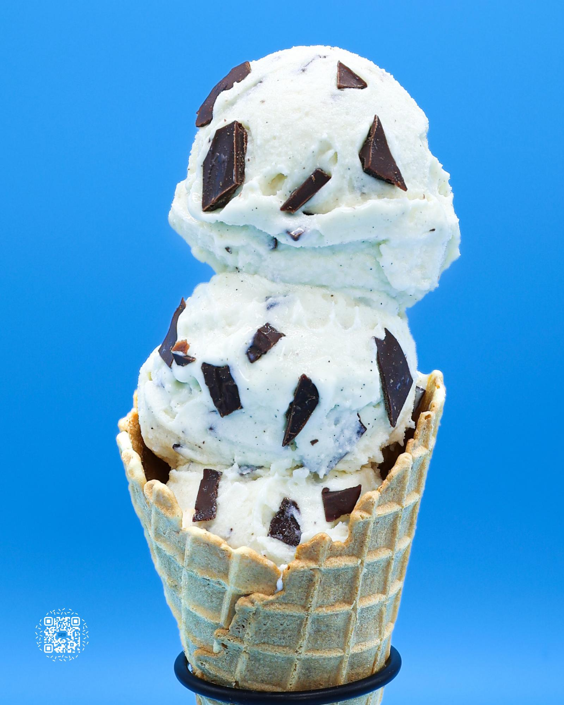

# CHOCOLATE CHIP

**Serves:** 1 | **Prep:** 15 MINS | **Cook:** 15 MINS

## Macros

| Calories | Fat | Carbs | Net Carbs | Protein |
|----------|-----|-------|-----------|---------|
| 495 | 23 | 51 | 31 | 41 |

## Ingredients

### MELTING CHOCOLATE

- 113g semi-sweet chocolate bar
- 7g peanut oil

### WET

- 410g 2% milk
- 1 egg yolk
- 1 vanilla bean
- 4.2g vanilla extract

### DRY

- 16.2g Gorilla Mode Vanilla Ice Cream protein
- 8g fat-free milk powder
- 20g granulated erythritol
- 0.5g salt
- 0.7g xanthan gum

### MIX-INS

- 26g melting chocolate

## Directions

1. Fill a small pot with 1" of water and bring to a simmer. Place a ceramic bowl over the pot, making sure it's wider than the pot. Add the chocolate and melt.
2. Stir in oil with a whisk until combined.
3. Line a quarter sheet pan or small tray with parchment paper.
4. Spread melted chocolate into a thin layer on the pan and freeze until solid.
5. Chop frozen chocolate into bite-sized pieces, quickly transfer to a plastic bag, and freeze. Makes enough for 5 pints.
6. Using a knife, cut a vanilla bean pod down the middle, scrape the beans out of the inside of the pod, and add to a high-sided container.
7. Add remaining wet ingredients into the high-sided container.
8. Place the dry ingredients in a measuring cup and whisk to combine.
9. With an immersion blender at the bottom of the container, start blending wet ingredients while gradually adding dry ingredients.
10. Once all dry ingredients dissolve, blend for another 90 seconds.
11. Pour into a pint, cover, and freeze for 24 hours.
12. Take the frozen pint, run the sides and bottom under hot water for 1 minute, load it into the CREAMI®, and hit the light ice cream button.
13. Use a butter knife to make a 1" hole in the center of the pint, remove the ice cream, and take the chocolate out of the freezer.
14. Quickly add the chocolate to the pint, return the ice cream, reload, and run the mix-in setting.
15. Scoop. Crunch. Smile. Repeat.

## Tips

Push down the chocolate so most of it sits near the bottom of the pint. This ensures it spreads evenly throughout during the mix-in setting.

