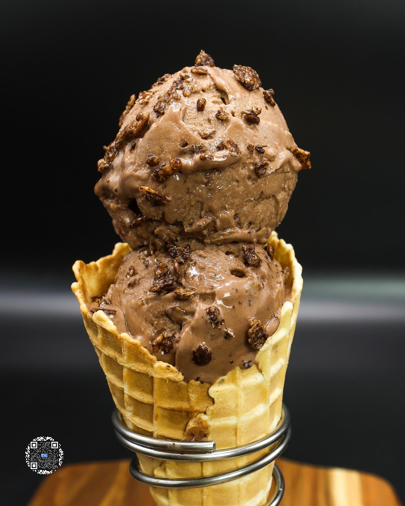

# COCOA CRISPS ICE CREAM

**Serves:** 1 | **Prep:** 5 MINS | **Cook:** 5 MINS

## Macros

| Calories | Fat | Carbs | Net Carbs | Protein |
|----------|-----|-------|-----------|---------|
| 176 | 6 | 64 | 14 | 12 |

## Ingredients

### WET

- 160g 1% milk
- 280g unsweetened almond milk

### DRY

- 50g granulated erythritol
- 1g salt
- 1g xanthan gum
- 8g dutch-processed cocoa powder

### MIX-INS

- 10g Cocoa Pebbles® cereal

## Directions

1. Pour Wet Ingredients directly into the pint.
2. In a small bowl, add Dry Ingredients and whisk together.
3. Put a small hand blender into the bottom of your pint and start blending the Wet Ingredients together. Slowly add your Dry Ingredients into the middle of the pint.
4. Once all Dry Ingredients have dissolved in the pint, continue blending for 90 seconds.
5. Put the top on the pint and freeze for 24 hours.
6. Take the frozen pint, run it under hot water for 40 seconds, load it into the CREAMi®, and hit the ice cream button.
7. Get Mix-ins ready and once the first spin is finished, load pint right back up for a re-spin.
8. Using a butter knife, make a hole in the middle of the pint about 1" in diameter, pull the ice cream out, and load the Cocoa Pebbles® into the middle. PRO TIP: Leave a couple grams of cereal on the side to top your pint with when it is finished.
9. Load the pint back up, press the mix-in setting, and you now have a cream that is ready to eat.

## Tips

Add 1-2 drops of coffee extract to the Wet Ingredients to get an even deeper and more satisfying chocolate flavor.

