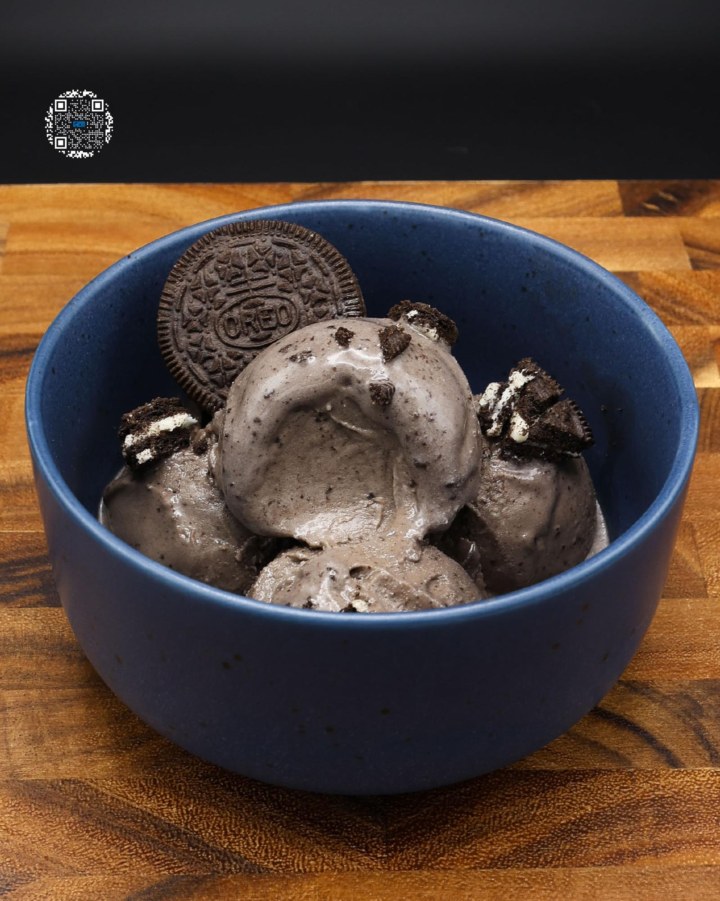

# COOKIES & CREAM

**Serves:** 1 | **Prep:** 5 MINS | **Cook:** 5 MINS

## Macros

| Calories | Fat | Carbs | Net Carbs | Protein |
|----------|-----|-------|-----------|---------|
| 512 | 12 | 61 | 51 | 49 |

## Ingredients

### WET

- 410g fat-free milk
- 1 Oreo®
- 4.2g vanilla extract

### DRY

- 35.6g Gorilla Mode Cookies & Cream protein
- 10g granulated erythritol
- 4g black cocoa powder
- .5g salt
- .5g xanthan gum

### MIX-INS

- 2 Oreos®, frozen
- 1 Oreo®, chopped

## Directions

1. Pour milk into a high sided container, dunk an Oreo® for 15-20 seconds, and add the wet cookie to a plastic bag. Repeat, seal the plastic bag, and freeze.
2. Add an Oreo® and vanilla extract to the container.
3. In a measuring cup, add Dry Ingredients and whisk together.
4. Using an immersion blender, start blending the Wet Ingredients together. Slowly add the Dry Ingredients into the middle of the pint.
5. Once all Dry Ingredients have dissolved, continue blending for 90 seconds.
6. Put the top on the pint and freeze for 24 hours.
7. Take the frozen pint, run it under hot water for 1 minute, load it into the CREAMI®, and hit the sorbet button.
8. Once the first spin is finished, make a hole near the side of the pint about 1" in diameter.
9. Chop the frozen Oreos® in half and fill the hole.
10. Add the ice cream that was taken out back on top, load it into the CREAMI®, and hit the mix-in function.
11. Chop up a fresh Oreo® and top cream with cookie crumbles.
12. Eat.

