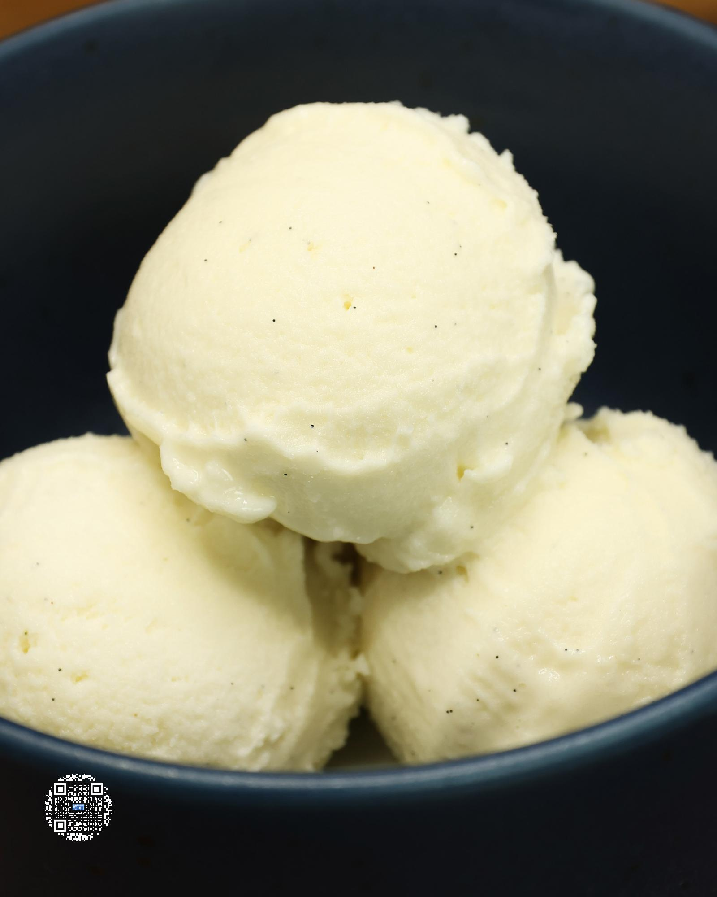

# VANILLA BASE "BEST"

**Serves:** 1 | **Prep:** 5 MINS | **Cook:** 5 MINS

## Macros

| Calories | Fat | Carbs | Net Carbs | Protein |
|----------|-----|-------|-----------|---------|
| 285 | 13 | 58 | 13 | 26 |

## Ingredients

### WET

- 430g 2% milk
- 1 egg yolk
- 4g vanilla extract
- 1/2 vanilla bean pod

### DRY

- 45g granulated erythritol
- 1g salt
- 1g xanthan gum

## Directions

1. Using a knife, cut a vanilla bean pod down the middle, scrape the beans of half of the pod, and add to a high sided container.
2. Add milk, vanilla extract, and an egg yolk to the container.
3. In a small bowl, add Dry Ingredients and whisk together.
4. Put an immersion blender in the bottom of the container and start blending the Wet Ingredients together. Slowly add your Dry Ingredients into the container.
5. Once all Dry Ingredients have dissolved, continue blending for 90 seconds.
6. Add the liquid to a pint, put the top on, and freeze for 24 hours.
7. Take the frozen pint, run it under hot water for 60 seconds, load it into the CREAMi®, and hit the ice cream button.
8. Once the first spin is finished, load pint right back up for a re-spin.
9. Adjust creaminess with an additional re-spin if necessary.
10. Grab a spoon and enjoy.

