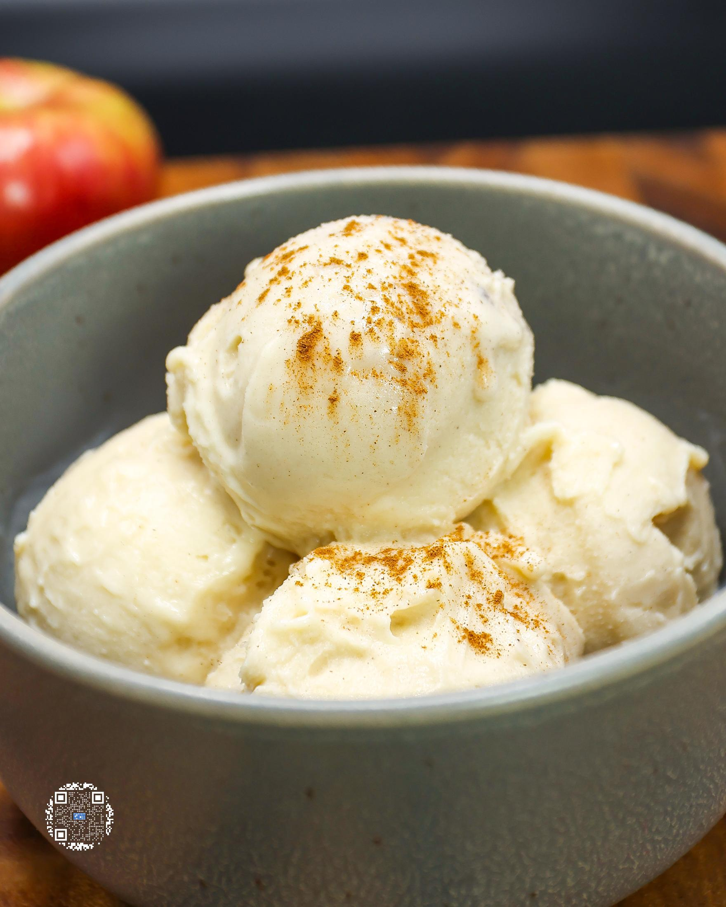
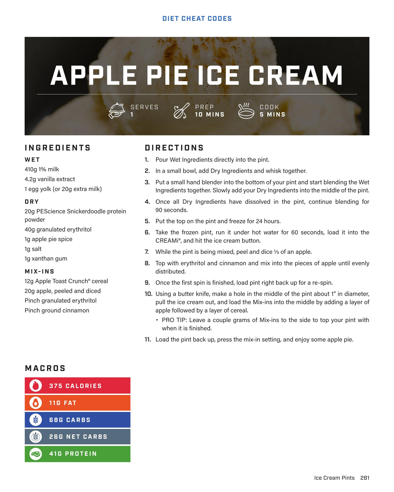

# APPLE PIE ICE CREAM

**Serves:** 1 | **Prep:** 10 MINS | **Cook:** 5 MINS

## Macros

| Calories | Fat | Carbs | Net Carbs | Protein |
|----------|-----|-------|-----------|---------|
| 375 | 11 | 68 | 28 | 41 |

## Ingredients

### WET

- 410g 1% milk
- 4.2g vanilla extract
- 1 egg yolk (or 20g extra milk)

### DRY

- 20g PEScience Snickerdoodle protein powder
- 40g granulated erythritol
- 1g apple pie spice
- 1g salt
- 1g xanthan gum

### MIX-INS

- 12g Apple Toast Crunch® cereal
- 20g apple, peeled and diced
- Pinch granulated erythritol
- Pinch ground cinnamon

## Directions

1. Pour Wet Ingredients directly into the pint.
2. In a small bowl, add Dry Ingredients and whisk together.
3. Put a small hand blender into the bottom of your pint and start blending the Wet Ingredients together. Slowly add your Dry Ingredients into the middle of the pint.
4. Once all Dry Ingredients have dissolved in the pint, continue blending for 90 seconds.
5. Put the top on the pint and freeze for 24 hours.
6. Take the frozen pint, run it under hot water for 60 seconds, load it into the CREAMi®, and hit the ice cream button.
7. While the pint is being mixed, peel and dice ½ of an apple.
8. Top with erythritol and cinnamon and mix into the pieces of apple until evenly distributed.
9. Once the first spin is finished, load pint right back up for a re-spin.
10. Using a butter knife, make a hole in the middle of the pint about 1" in diameter, pull the ice cream out, and load the Mix-ins into the middle by adding a layer of apple followed by a layer of cereal.
11. Load the pint back up, press the mix-in setting, and enjoy some apple pie.

## Tips

Leave a couple grams of Mix-ins to the side to top your pint with when it is finished.

## Additional Recipe Pages

## Source Pages

281, 282
