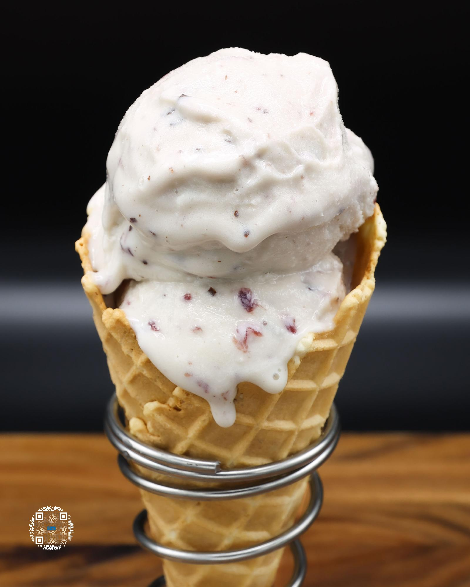

# CHERRY CHOCOLATE CHUNK

**Serves:** 1 | **Prep:** 10 MINS | **Cook:** 5 MINS

## Macros

| Calories | Fat | Carbs | Net Carbs | Protein |
|----------|-----|-------|-----------|---------|
| 497 | 22 | 78 | 38 | 39 |

## Ingredients

### WET

- 20g cherry juice, jarred
- 380g 2% milk
- 2 egg yolks
- 4.2g vanilla extract

### DRY

- 16g PEScience Gourmet Vanilla protein
- 40g granulated erythritol
- .5g salt
- .8g xanthan gum

### MIX-INS

- 5 bing cherries, jarred
- 14g dark chocolate

## Directions

1. Add Wet Ingredients into a high sided container.
2. In a measuring cup, add Dry Ingredients and whisk together.
3. Put an immersion blender in the bottom of the container and start blending the Wet Ingredients together. Slowly add your Dry Ingredients into the container.
4. Once all Dry Ingredients have dissolved, continue blending for 90 seconds.
5. Add the liquid to a pint, put the top on, and freeze for 24 hours.
6. Take the frozen pint, run it under hot water for 60 seconds, load it into the CREAMi®, and hit the sorbet button.
7. While mixing, chop chocolate into 1/8" chunks and press cherries into paper towels to remove excess liquid.
8. Using a butter knife, make a hole in the middle of the pint about 1" in diameter, pull the ice cream out, and load the Mix-ins up by adding a layer of chocolate followed by a layer of cherries. Repeat layering until all Mix-ins are added.
9. Place the previously removed ice cream into the pint, reload the pint, and press the mix-in setting.
10. Grab a spoon and enjoy.

## Tips

You can deseed, juice, and strain your own cherries in place of the jarred cherries and cherry juice. Also, you can make a homemade version of jarred cherries. Please refer to the recipe video for more detailed information.

