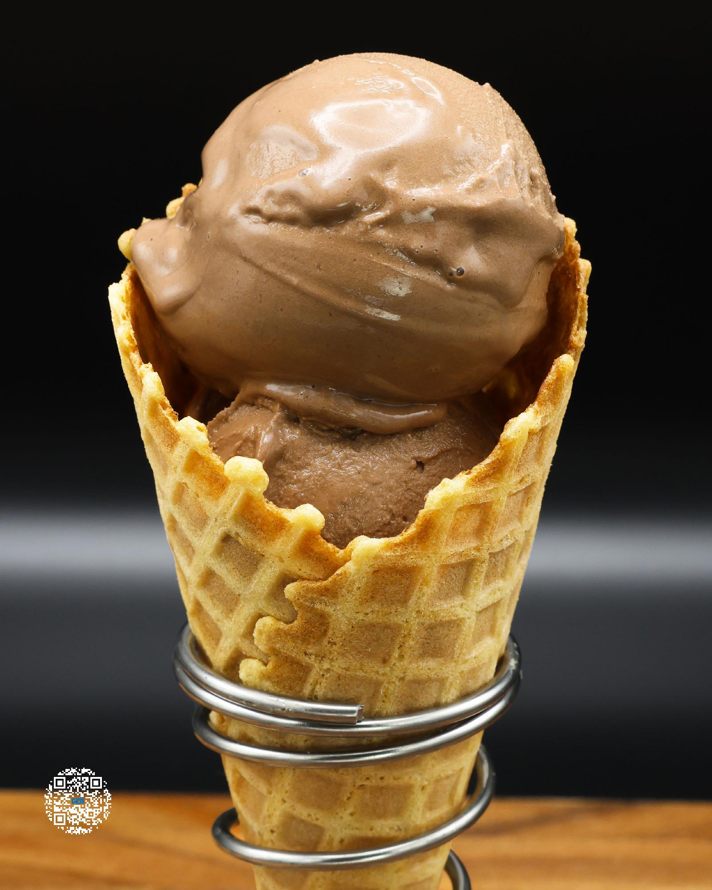

# CHOCOLATE BASE "BEST"

**Serves:** 1 | **Prep:** 10 MINS | **Cook:** 5 MINS

## Macros

| Calories | Fat | Carbs | Net Carbs | Protein |
|----------|-----|-------|-----------|---------|
| 345 | 14 | 71 | 21 | 28 |

## Ingredients

### WET

- 410g 1% milk
- 1 egg yolk
- 2.1g vanilla extract
- 14g semi-sweet chocolate, melted

### DRY

- 50g granulated erythritol
- 10g cocoa powder
- 1g salt
- 1g xanthan gum

## Directions

1. Pour milk, an egg yolk, and vanilla extract into a high sided container and mix for 30 seconds using an immersion blender.
2. In a small bowl, add Dry Ingredients and mix to combine.
3. Microwave the wet ingredients for 30-60 seconds or until they reach 80-90°F and stir using a spoon.
4. Add chocolate to a small bowl and microwave for 45-60 seconds or until melted. Put on a glove and stir with a rubber spatula.
5. Add melted chocolate to the wet ingredients and mix for 30 seconds. Do this as quickly as possible. We want to make sure the chocolate stays melted and fully mixes into the milk mixture.
6. While blending, slowly add your Dry Ingredients into the container.
7. Once all Dry Ingredients have dissolved, continue blending for 90 seconds.
8. Add the liquid to a pint, put the top on, and freeze for 36 hours. As an added precaution, you can strain the liquid while pouring it into the pint to ensure that no solid particles are introduced into the container.
9. Take the frozen pint, run it under hot water for 60 seconds, load it into the CREAMi®, and hit the light ice cream button.
10. Once the first spin is finished, load pint right back up and hit the mix-in setting. For a soft serve like consistency, run the re-spin setting instead.
11. Adjust creaminess with an additional mix-in/re-spin if necessary.
12. Grab a spoon and enjoy.

