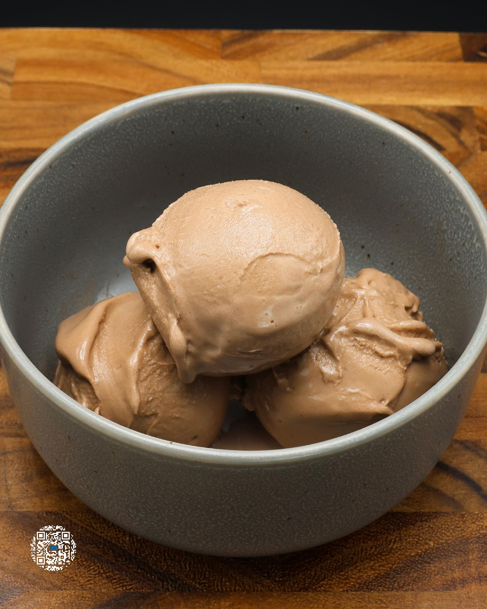
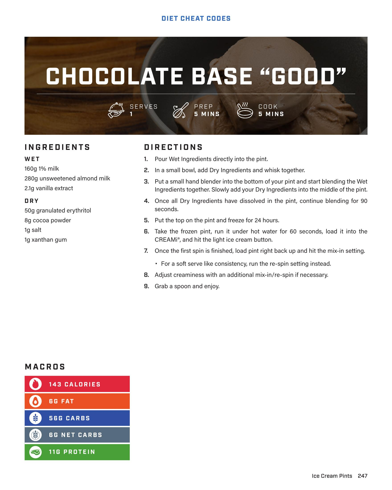

# CHOCOLATE BASE "GOOD"

**Serves:** 1 | **Prep:** 5 MINS | **Cook:** 5 MINS

## Macros

| Calories | Fat | Carbs | Net Carbs | Protein |
|----------|-----|-------|-----------|---------|
| 143 | 6 | 58 | 6 | 11 |

## Ingredients

### WET

- 160g 1% milk
- 280g unsweetened almond milk
- 2.1g vanilla extract

### DRY

- 50g granulated erythritol
- 8g cocoa powder
- 1g salt
- 1g xanthan gum

## Directions

1. Pour Wet Ingredients directly into the pint.
2. In a small bowl, add Dry Ingredients and whisk together.
3. Put a small hand blender into the bottom of your pint and start blending the Wet Ingredients together. Slowly add your Dry Ingredients into the middle of the pint.
4. Once all Dry Ingredients have dissolved in the pint, continue blending for 90 seconds.
5. Put the top on the pint and freeze for 24 hours.
6. Take the frozen pint, run it under hot water for 60 seconds, load it into the CREAMI®, and hit the light ice cream button.
7. Once the first spin is finished, load pint right back up and hit the mix-in setting.
8. For a soft serve like consistency, run the re-spin setting instead.
9. Adjust creaminess with an additional mix-in/re-spin if necessary.
10. Grab a spoon and enjoy.

## Additional Recipe Pages

## Source Pages

247, 248
