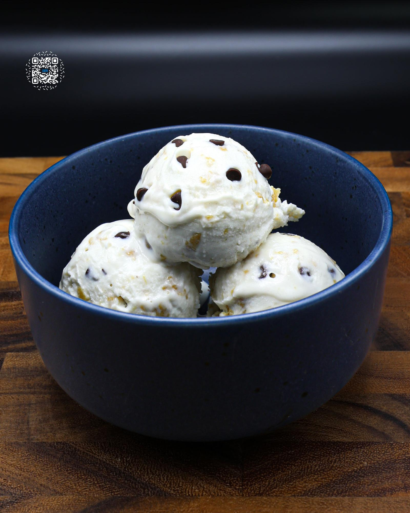

# CHOCOLATE CHIP COOKIE DOUGH

**Serves:** 1 | **Prep:** 15 MINS | **Cook:** 5 MINS

## Macros

| Calories | Fat | Carbs | Net Carbs | Protein |
|----------|-----|-------|-----------|---------|
| 499 | 15 | 44 | 26 | 58 |

## Ingredients

### WET

- 430g 2% milk
- 4.2g vanilla extract

### DRY

- 32.4g Gorilla Mode Vanilla Ice Cream protein
- 10g granulated erythritol
- .5g salt
- .5g xanthan gum

### MIX-INS

- 50g cookie dough

## Directions

1. Make COOKIE DOUGH V2 and refrigerate.
2. Add Wet Ingredients into a high-sided container.
3. In a measuring cup, add Dry Ingredients and whisk together.
4. Put an immersion blender in the bottom of the container and start blending the Wet Ingredients together. Slowly add your Dry Ingredients into the container.
5. Once all Dry Ingredients have dissolved, continue blending for 90 seconds.
6. Add the liquid to a pint, put the top on, and freeze for 24 hours.
7. Take the frozen pint, run it under hot water for 60 seconds, load it into the CREAMi®, and hit the sorbet button.
8. Using a butter knife, make a hole in the middle of the pint about 1" in diameter, pull the ice cream out, and load the cookie dough into the center.
9. Place the previously removed ice cream into the pint, reload the pint, and press the mix-in setting.
10. Grab a spoon and enjoy.

## Tips

Don't pull the cookie dough out of the fridge until you need to fill the center. This will keep it in the perfect sized chunks after the mix-in setting.

