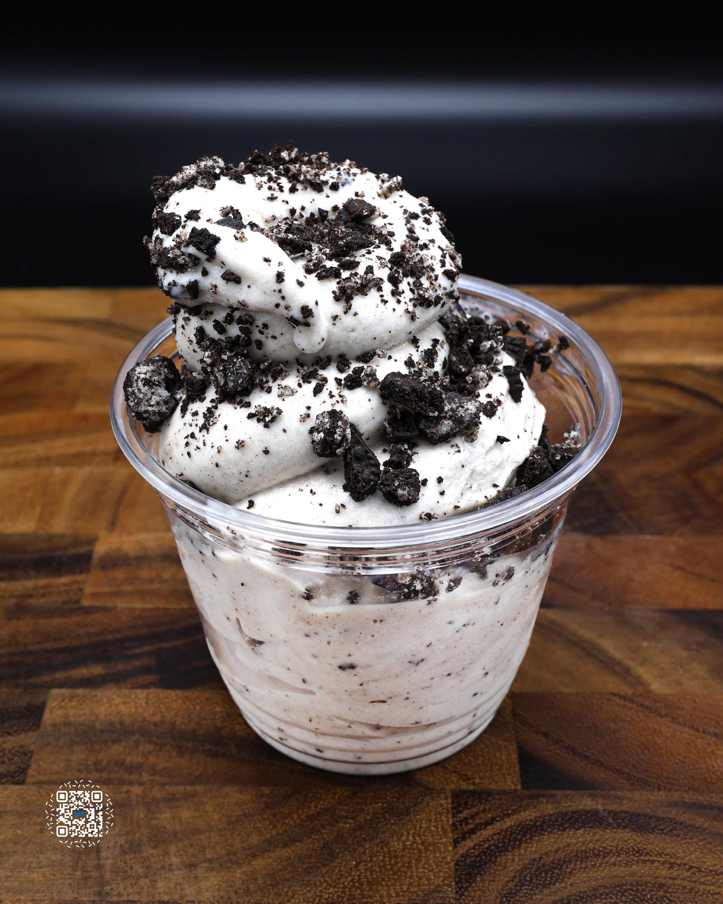
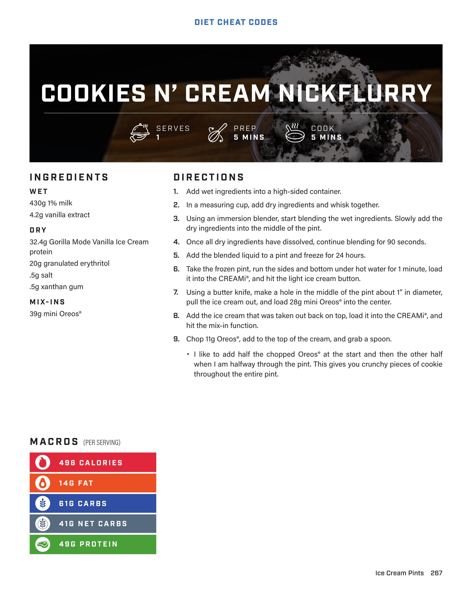

# COOKIES N' CREAM NICKFLURRY

**Serves:** 1 | **Prep:** 5 MINS | **Cook:** 5 MINS

## Macros

| Calories | Fat | Carbs | Net Carbs | Protein |
|----------|-----|-------|-----------|---------|
| 496 | 14 | 61 | 41 | 49 |

## Ingredients

### WET

- 430g 1% milk
- 4.2g vanilla extract

### DRY

- 32.4g Gorilla Mode Vanilla Ice Cream protein
- 20g granulated erythritol
- .5g salt
- .5g xanthan gum

### MIX-INS

- 39g mini Oreos®

## Directions

1. Add wet ingredients into a high-sided container.
2. In a measuring cup, add dry ingredients and whisk together.
3. Using an immersion blender, start blending the wet ingredients. Slowly add the dry ingredients into the middle of the pint.
4. Once all dry ingredients have dissolved, continue blending for 90 seconds.
5. Add the blended liquid to a pint and freeze for 24 hours.
6. Take the frozen pint, run the sides and bottom under hot water for 1 minute, load it into the CREAMI®, and hit the light ice cream button.
7. Using a butter knife, make a hole in the middle of the pint about 1" in diameter, pull the ice cream out, and load 28g mini Oreos® into the center.
8. Add the ice cream that was taken out back on top, load it into the CREAMI®, and hit the mix-in function.
9. Chop 11g Oreos®, add to the top of the cream, and grab a spoon.

## Tips

I like to add half the chopped Oreos® at the start and then the other half when I am halfway through the pint. This gives you crunchy pieces of cookie throughout the entire pint.

## Additional Recipe Pages

## Source Pages

267, 268
